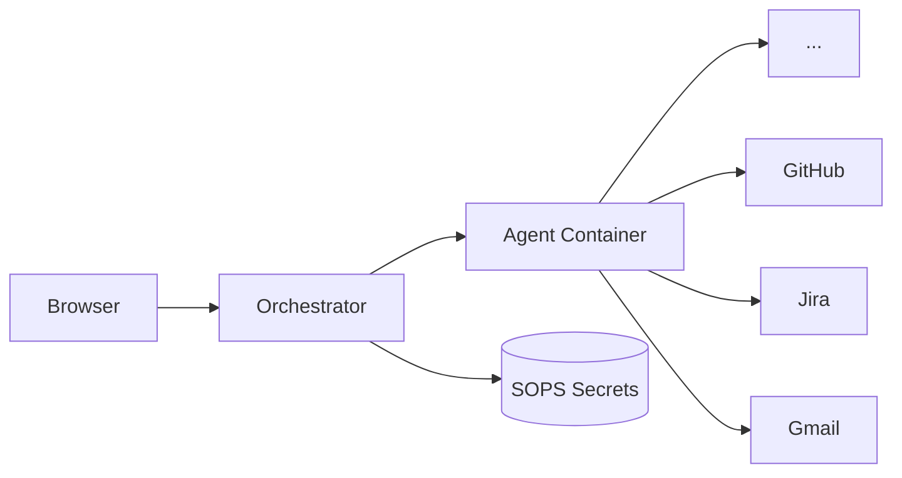

# Agent Land

Minimal, self-hosted platform for running Dockerized AI coding agents. Choose connectors, write a task, and get live-streamed agent output with encrypted secret management via SOPS/Age.

## Architecture



The **orchestrator** is a Node.js/TypeScript Express server with HTMX + Pico CSS frontend. Agent **containers** run [pi](https://www.npmjs.com/package/@earendil-works/pi-coding-agent) headless with pre-baked tools (git, curl, jq, gh). Secrets are encrypted at rest with SOPS/Age and decrypted in-memory only when launching an agent.

## Quick Start

```bash
# 1. Install dependencies
npm install

# 2. Configure
cp .env.example .env
# Edit .env with your OPENCODE_API_KEY

# 3. Install SOPS + Age
brew install sops age

# 4. Build the agent image
cd agent-image && docker build -t agent-land-pi:latest . && cd ..

# 5. Run
npm run dev
# → http://localhost:3000
```

### Docker Compose

```bash
docker compose up --build
```

### Setup

1. Go to **Secrets** → add encrypted API tokens (e.g. Jira PAT, GitHub token)
2. Go to **Connectors** → create named pointers to those secrets
3. Go to **Agents** → write a task, select connectors, launch

## Features

- **SOPS/Age secrets** — encrypted at rest, decrypted in-memory only at launch
- **Live log streaming** via SSE — styled agent output in real-time
- **Connector abstraction** — point at encrypted secrets, select at launch time
- **Pre-baked agent tools** — git, curl, jq, gh ready in the container
- **Agent skills** — each connector type teaches the agent how to use the API
- **No database** — flat JSON files on mounted volumes
- **Runs on Dokku** — single Dockerfile, no orchestration

## Docs

- [Architecture Decision Records](docs/adrs/)
- [Roadmap](ROADMAP.md)

## License

MIT
