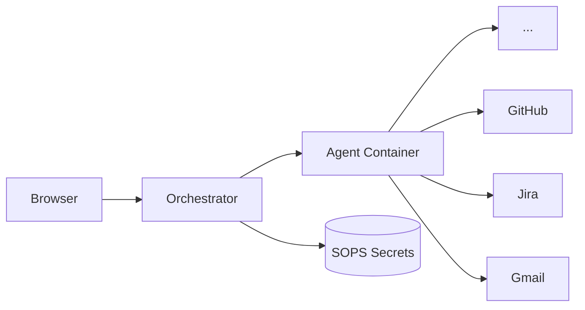

# Agent Land

Minimal, self-hosted platform for running Dockerized AI coding agents as long-lived sessions. Choose connectors, send a prompt, and get live-streamed agent output with encrypted secret management via SOPS/Age.

## Quick Start

**Prerequisites:** Docker, Docker Compose, [SOPS](https://github.com/getsops/sops), [Age](https://github.com/FiloSottile/age), and an [OpenCode](https://opencode.ai) API key.

```bash
# 1. Clone and enter the repo
git clone https://github.com/marcoklein/agent-land.git
cd agent-land

# 2. Generate an Age key pair (for encrypting secrets)
age-keygen -o .age-key

# 3. Configure environment
cp .env.example .env

# 4. Build the agent image
docker build -t agent-land-pi:latest ./agent-image

# 5. Start
docker compose up --build -d
# Open http://localhost:3000
```

## Usage

1. **Secrets** — add encrypted API tokens (e.g. Jira PAT, GitHub token)
2. **Connectors** — create named pointers to those secrets
3. **Sessions** — write a prompt, select connectors, launch

Agent output streams in real-time via SSE. Each session persists its record to `data/sessions/`.

## Features

- **SOPS/Age secrets** — encrypted at rest, decrypted in-memory only at launch
- **Live log streaming** via SSE — styled agent output in real-time
- **Connector abstraction** — point at encrypted secrets, select at launch time
- **RPC-driven sessions** — every session is a running pi agent (`--mode rpc`) with `auto`/`manual` permission policies
- **Workspace provisioning** — persistent git checkout (`gh` credential helper) mounted per session, survives redeploys
- **Session recovery** — durable event log, graceful drain, and re-attach on redeploy
- **Terminal client (`al`)** — zero-dependency CLI to create, chat, watch, and script sessions
- **Pre-baked agent tools** — git, curl, jq, gh ready in the container
- **Agent skills** — each connector type teaches the agent how to use the API
- **No database** — flat JSON files on mounted volumes
- **Runs on Dokku** — single Dockerfile, no orchestration

## Architecture



The **orchestrator** is a Node.js/TypeScript Express server with HTMX + Pico CSS frontend. Agent **containers** run [pi](https://www.npmjs.com/package/@earendil-works/pi-coding-agent) in `--mode rpc` with pre-baked tools (git, curl, jq, gh). Secrets are encrypted at rest with SOPS/Age and decrypted in-memory only when launching an agent.

## Sessions API

The website is backed by a JSON HTTP + SSE API mounted under `/api/sessions`:

```
POST   /api/sessions                create a session  { connectors?, permissionPolicy?, model? }
GET    /api/sessions                list sessions
GET    /api/sessions/:id            get a session
POST   /api/sessions/:id/prompt     send a prompt  { message }
POST   /api/sessions/:id/respond    answer a pending dialog  { requestId, value? | confirmed? | cancelled? }
POST   /api/sessions/:id/abort      abort the current turn
DELETE /api/sessions/:id            kill + remove the session container
GET    /api/sessions/:id/events     SSE stream of session events
```

## Docs

- [Documentation](docs/README.md) — product, architecture, reference, and decisions
- [Architecture Decision Records](docs/adrs/)
- [Contributing](CONTRIBUTING.md)
- [Roadmap](ROADMAP.md)

## License

MIT
