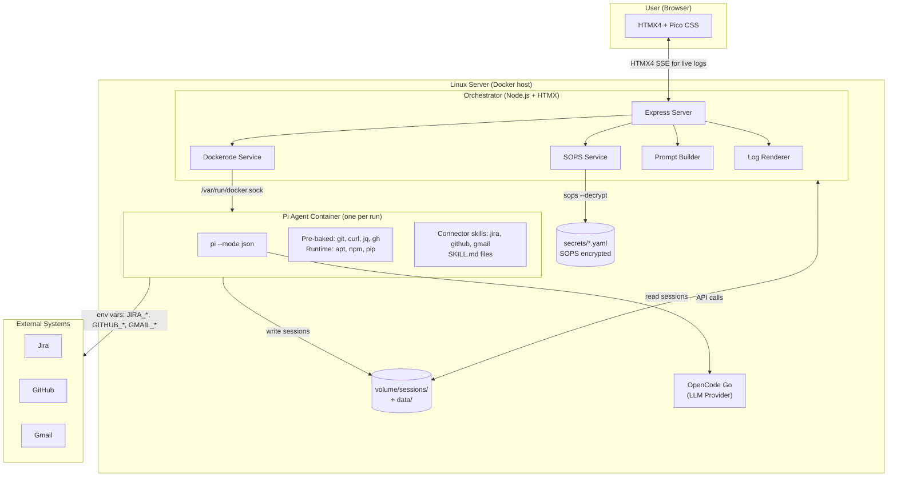
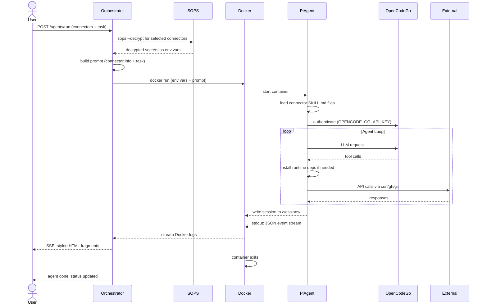
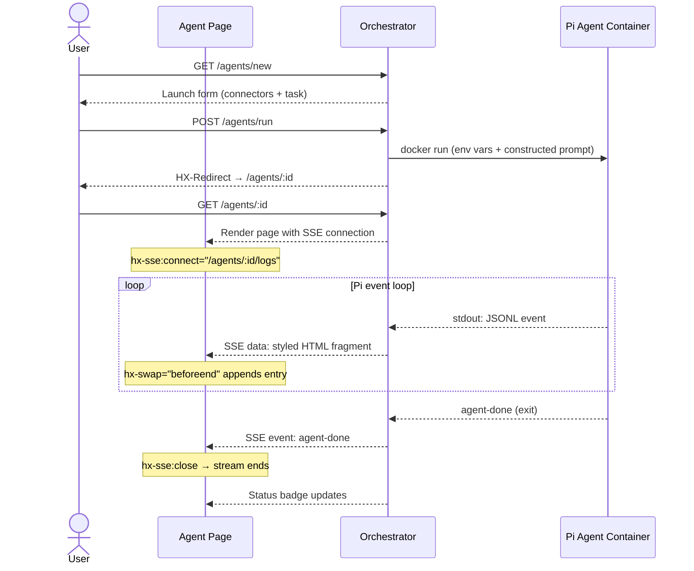
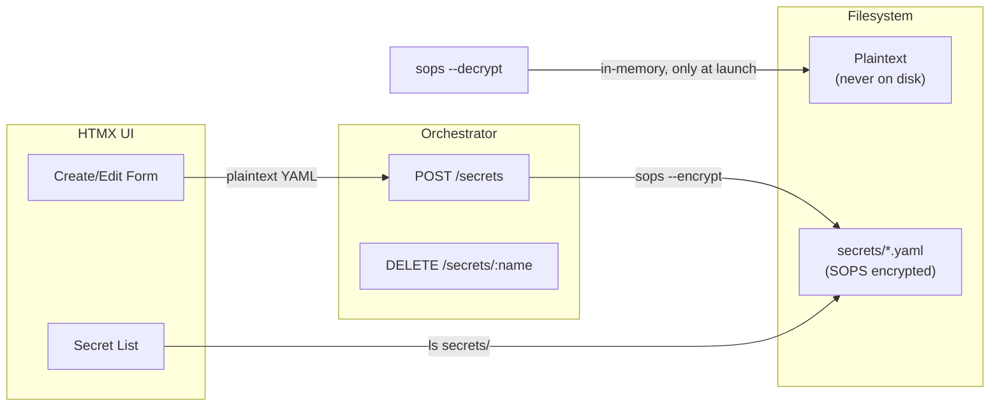

# Agent Land — Design Document

## Overview

Agent Land is a minimal agentic coding platform. An HTMX-based orchestrator manages SOPS/Age-encrypted secrets and launches Pi coding agents in Docker containers. Each agent run gets scoped credentials for specific external systems (connectors). OpenCode Go serves as the LLM provider.

## Architecture



## Agent Lifecycle



## Tech Stack

| Layer | Choice | Rationale |
|-------|--------|-----------|
| Runtime | Node.js 22 + TypeScript | Same ecosystem as pi agent; Dockerode native |
| HTTP | Express 5 + EJS | Most mature HTMX-compatible Node.js stack |
| UI | HTMX 4 + Pico CSS | Classless CSS (~20KB), no JS build step, dark mode |
| Streaming | HTMX4 SSE (hx-sse) | `fetch()` + `ReadableStream`; auto-swap unnamed events |
| Docker | Dockerode | Native Docker API from Node.js |
| Secrets | SOPS/Age via `execFile` | No native Node.js SOPS library; shell out |
| Storage | JSON files on mounted volume | No database dep; runs/connectors stored as flat files |

## Key Design Decisions

### 1. Orchestrator in TypeScript/Node.js

Pi is a Node.js package (`@earendil-works/pi-coding-agent`). Running the orchestrator in the same ecosystem avoids polyglot overhead. Dockerode provides native Docker API access. Express + EJS is the most mature HTMX-compatible stack in Node.js.

### 2. Docker Socket Mount (not DinD)

The orchestrator spawns sibling containers by mounting `/var/run/docker.sock`. Simpler than Docker-in-Docker: no nested daemon, shared image cache, straightforward networking. On Dokku: `dokku docker-options:add agent-land deploy "-v /var/run/docker.sock:/var/run/docker.sock"`.

### 3. SOPS/Age — One File Per Connector

Each connector gets its own SOPS-encrypted YAML file:

```yaml
# secrets/github-personal.yaml (after sops --decrypt)
GITHUB_TOKEN: ghp_xxx
GITHUB_API_URL: https://api.github.com
```

Files are encrypted at rest, decrypted in-memory only at agent launch time. Decrypted values exist as env vars inside the container and are never written to disk.

### 4. Connector Model

A connector is a named pointer to a secret + metadata about the external system. It is NOT a tool bundle — tools are pre-baked in the agent image and the agent installs any extras at runtime.

```json
{
  "name": "Work Jira",
  "type": "jira",
  "url": "https://your-domain.atlassian.net",
  "secretFile": "jira-work.yaml"
}
```

| Field | Purpose | Example |
|-------|---------|---------|
| `name` | Label in UI | "Work Jira" |
| `type` | Maps to connector SKILL.md and env var names | `jira` → `$JIRA_URL`, `$JIRA_API_TOKEN` |
| `url` | Shown in connector list without decrypting | `https://...` |
| `secretFile` | SOPS file to decrypt at launch | `jira-work.yaml` |

The SOPS file can contain any YAML — all key-value pairs become env vars passed to the container.

### 5. Agent Tool Strategy

Four tools pre-baked in the agent image. The agent installs everything else at runtime.

| Tool | Purpose | Install |
|------|---------|---------|
| `git` | Every code task | `apt-get install git` |
| `curl` | API calls (Jira, GitHub REST, anything) | `apt-get install curl` |
| `jq` | JSON parsing from API responses | `apt-get install jq` |
| `gh` | GitHub CLI — auto-reads `GITHUB_TOKEN` | GitHub APT repo |

Runtime: `apt-get install`, `npm install -g`, `pip install`. The agent has unrestricted `bash` and decides what it needs.

### 6. Connector Skills (SKILL.md)

Each connector type has a SKILL.md baked into the agent image that teaches pi how to use the API:

```
agent-image/
├── Dockerfile
├── entrypoint.sh
└── skills/
    ├── jira/SKILL.md      # Jira REST API with curl + jq
    ├── github/SKILL.md    # gh CLI + GitHub API
    └── gmail/SKILL.md     # Gmail API with curl
```

Pi auto-discovers skills from `~/.pi/agent/skills/`. A skill activates when its env vars are present.

### 7. Pi Headless via `--mode json`

Pi runs as `pi --mode json "task" --provider opencode-go --session-dir /sessions`. Emits JSONL event stream on stdout, persists full session tree to `/sessions/` on mounted volume.

### 8. Session Persistence on Mounted Volume

A Docker volume shared between orchestrator and agent containers stores:
- Pi session JSONL files (`/sessions/*.jsonl`)
- Connector definitions (`/data/connectors.json`)
- Agent run metadata (`/data/runs/`)

No database. The orchestrator reads session files directly from disk.

### 9. HTMX4 + Pico CSS for UI

Classless CSS (~20KB), no JS build step. Live log streaming uses HTMX4's `hx-sse` extension (`fetch()` + `ReadableStream`). Each SSE `data:` line is an HTML fragment appended to the log viewer:

```html
<div hx-sse:connect="/agents/:id/logs"
     hx-swap="beforeend"
     hx-sse:close="agent-done">
</div>
```

### 10. Dokku-Deployable from Day One

Dockerfile at repo root (Dokku auto-detects). Socket access and volumes configured via Dokku commands in `personal-infra/apps/agent-land.sh`.

## Data Model

### Connector

```json
{
  "name": "Work Jira",
  "type": "jira",
  "url": "https://your-domain.atlassian.net",
  "secretFile": "jira-work.yaml"
}
```

### Agent Run

```json
{
  "id": "a1b2c3d4",
  "task": "Fix the login rate limiting",
  "connectors": ["jira-work", "github-personal"],
  "model": "opencode-go/default",
  "status": "completed",
  "containerId": "abc123def456",
  "sessionFile": "a1b2c3d4.jsonl",
  "startedAt": "2026-07-27T14:32:01Z",
  "finishedAt": "2026-07-27T14:36:42Z",
  "exitCode": 0
}
```

## Agent Prompt Construction

The user writes a free-form task. The orchestrator auto-prepends connector info:

**User input:** `"Fix the login rate limiting"` with connectors `jira-work`, `github-personal`.

**Constructed prompt:**

```
Connectors available this session:
- jira-work (Jira): Credentials in $JIRA_URL, $JIRA_API_TOKEN
- github-personal (GitHub): Credentials in $GITHUB_TOKEN
---
Fix the login rate limiting
```

The user can also describe repos, issue IDs, or clone instructions directly in the task:

> "Clone github.com/me/my-project, read Jira issue ABC-123, and fix the login rate limiting"

## Agent Run Lifecycle (Frontend)



## Data Flow: Secret Management



Secrets are never written to disk in plaintext. Creation: user pastes YAML → orchestrator pipes to `sops --encrypt /dev/stdin > secrets/name.yaml`. Decryption: only at agent launch time via `sops --decrypt`, output captured in-memory.

## Security Boundaries

```
┌──────────────────────────────────────────────────┐
│ TRUST BOUNDARY: orchestrator code                │
│ (has Docker socket, age private key, file I/O)   │
│                                                  │
│  ┌────────────────────────────────────────────┐  │
│  │ TRUST BOUNDARY: agent container            │  │
│  │ (has decrypted secrets as env vars,        │  │
│  │  unrestricted bash execution)             │  │
│  │                                            │  │
│  │  The agent can:                            │  │
│  │  - Call external APIs with given creds     │  │
│  │  - Read/write files in the workspace       │  │
│  │  - Run arbitrary bash commands             │  │
│  │  - Install tools at runtime                │  │
│  │  - NOT access other containers' secrets    │  │
│  │  - NOT access the Docker socket            │  │
│  │  - NOT access SOPS-encrypted files         │  │
│  └────────────────────────────────────────────┘  │
└──────────────────────────────────────────────────┘
```

## No Authentication (v1)

Personal tool on a trusted server. Security model:
- SOPS/Age encryption for secrets at rest
- Network isolation (SSH tunnel or internal network)
- Docker container isolation between runs

HTTP basic auth can be added later (~1 line via Dokku, ~30 lines via middleware).

## Agent Image

```dockerfile
FROM node:22-slim

# Pre-baked tools: universally needed for coding agent tasks
RUN apt-get update && apt-get install -y --no-install-recommends \
    git \
    curl \
    jq \
    && rm -rf /var/lib/apt/lists/*

# GitHub CLI via official APT repo
RUN curl -fsSL https://cli.github.com/packages/githubcli-archive-keyring.gpg \
    | dd of=/usr/share/keyrings/githubcli-archive-keyring.gpg \
    && echo "deb [arch=$(dpkg --print-architecture) signed-by=/usr/share/keyrings/githubcli-archive-keyring.gpg] https://cli.github.com/packages stable main" \
    | tee /etc/apt/sources.list.d/github-cli.list > /dev/null \
    && apt-get update && apt-get install -y gh \
    && rm -rf /var/lib/apt/lists/*

RUN npm install -g @earendil-works/pi-coding-agent@0.82.1

WORKDIR /workspace
COPY skills/ ~/.pi/agent/skills/
COPY entrypoint.sh /entrypoint.sh
RUN chmod +x /entrypoint.sh
ENTRYPOINT ["/entrypoint.sh"]
```

## Connector Skills

### `jira/SKILL.md`

```markdown
---
name: jira
description: Interact with Jira via REST API. Active when JIRA_URL and JIRA_API_TOKEN are set.
---

## Authentication
All requests use Basic auth:
```bash
curl -s -H "Authorization: Basic $(echo -n "email:$JIRA_API_TOKEN" | base64)" \
     -H "Accept: application/json" \
     "$JIRA_URL/rest/api/2/issue/ABC-123"
```

## Common Endpoints
- Get issue: GET /rest/api/2/issue/{key}
- Search: GET /rest/api/2/search?jql=...
- Transitions: GET /rest/api/2/issue/{key}/transitions
- Create issue: POST /rest/api/2/issue
- Add comment: POST /rest/api/2/issue/{key}/comment
- Update fields: PUT /rest/api/2/issue/{key}

Parse responses with `jq`. Use `jq -r` for raw strings.
```

### `github/SKILL.md`

```markdown
---
name: github
description: Interact with GitHub via gh CLI and REST API. Active when GITHUB_TOKEN is set.
---

## gh CLI (preferred)
gh auto-reads GITHUB_TOKEN. No auth needed.
```bash
gh issue view 123 --repo owner/repo
gh pr create --title "fix: ..." --body "..."
gh api /repos/owner/repo/issues --jq '.[].title'
```

## REST API (fallback)
```bash
curl -s -H "Authorization: Bearer $GITHUB_TOKEN" \
     -H "Accept: application/vnd.github+json" \
     https://api.github.com/repos/owner/repo/issues
```
```

### `gmail/SKILL.md`

```markdown
---
name: gmail
description: Interact with Gmail via REST API. Active when GMAIL_REFRESH_TOKEN is set.
---

Install gmcli for email access:
```bash
npm install -g @mariozechner/gmcli
```

Or use curl for direct API access:
```bash
# Get access token
TOKEN=$(curl -s -X POST https://oauth2.googleapis.com/token \
  -d "client_id=$GMAIL_CLIENT_ID&client_secret=$GMAIL_CLIENT_SECRET&refresh_token=$GMAIL_REFRESH_TOKEN&grant_type=refresh_token" \
  | jq -r .access_token)

# Search emails
curl -s -H "Authorization: Bearer $TOKEN" \
  "https://gmail.googleapis.com/gmail/v1/users/me/messages?q=subject:urgent"
```
```
