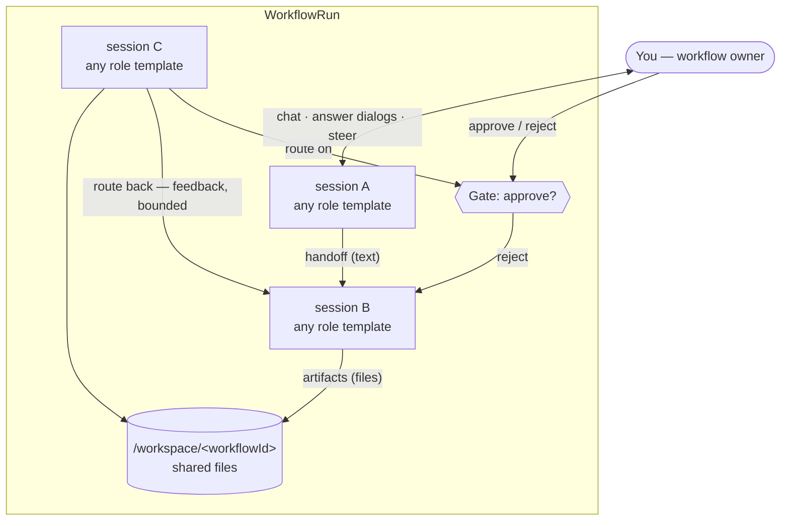
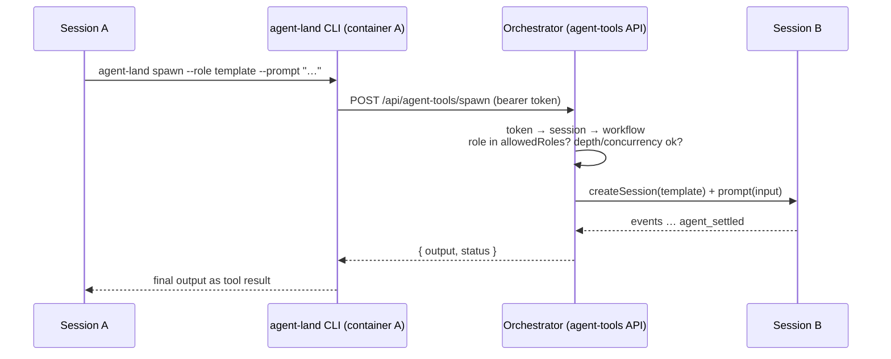
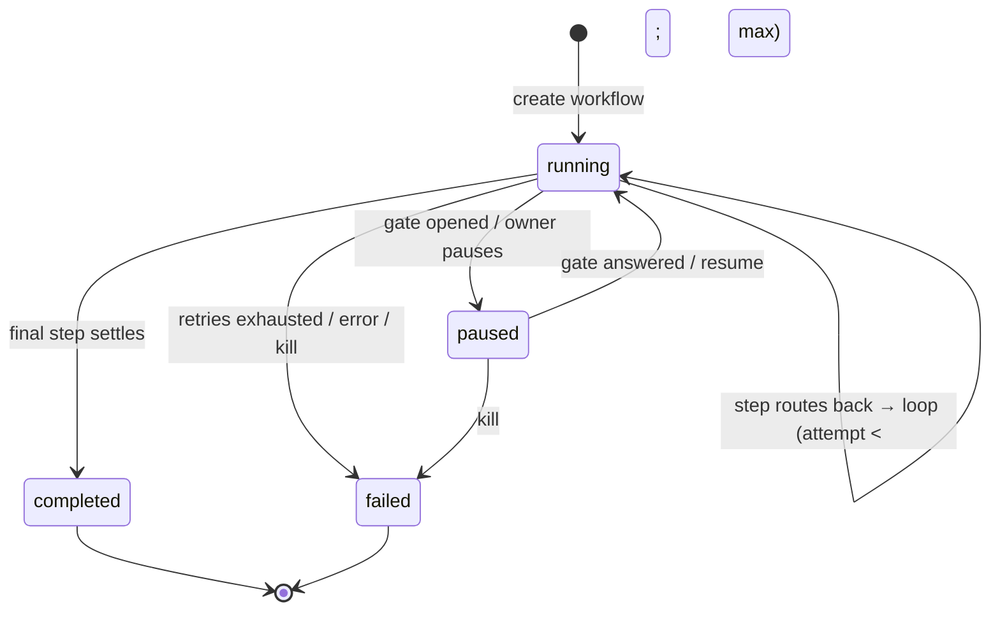
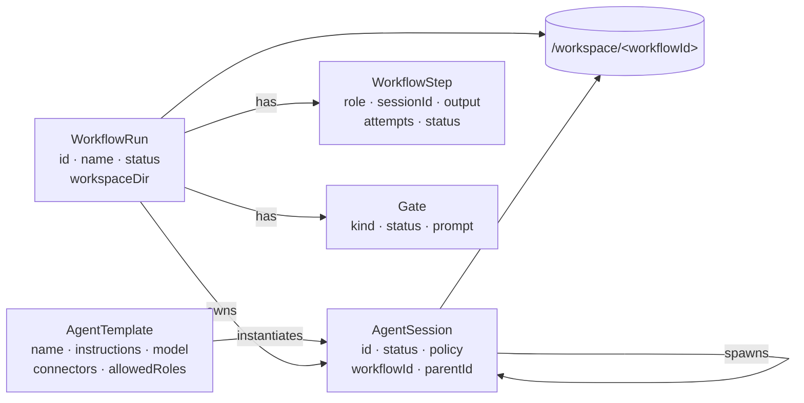
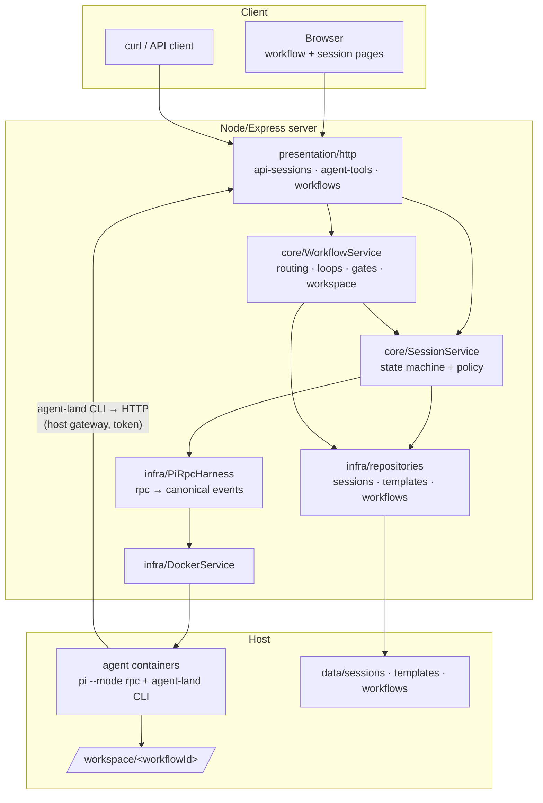
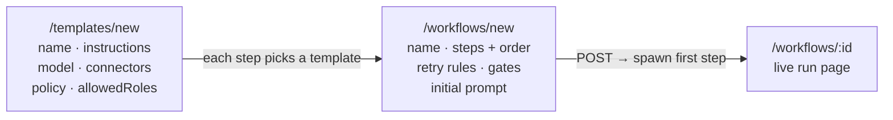
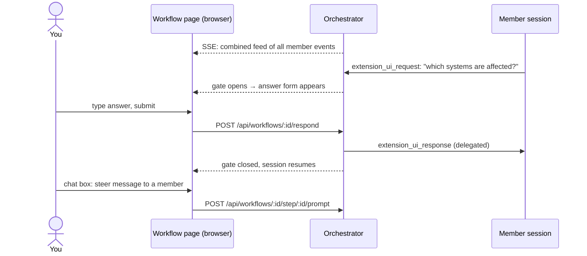
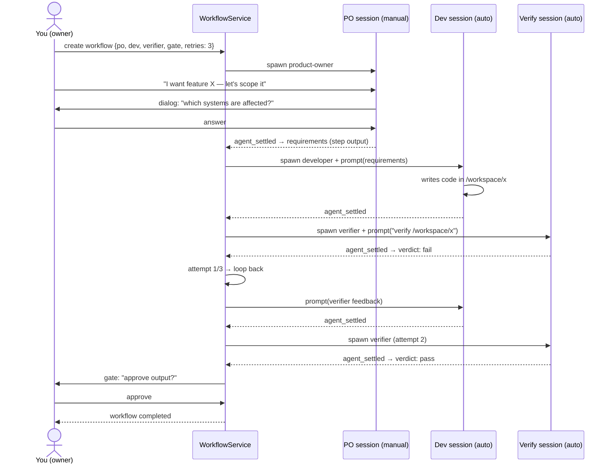

# Agent Orchestration — Design

High-level design for running *teams of agents* on top of the existing session model. A **workflow** dynamically assembles agent sessions from user-defined **role templates** — any number, any purpose — that interact through their outputs, share a filesystem workspace, and pause at explicit **gates** for the human owner. The foundation stays unchanged: every participant is a plain `AgentSession` (pi `--mode rpc` in its own container).

## Concept

- **Role** — a user-defined template with any name (no built-in roles): instructions, model, connectors, permission policy, and which other roles it may spawn. Roles are defined once; a workflow instantiates as many as it needs.
- **WorkflowRun** — the assembly: which roles, how handoffs route, where gates sit, how many retries. One shared workspace directory per workflow.
- **Gate** — an explicit stop-and-ask-the-human point (e.g. "approve this output?"). Everything else flows without asking.
- **You** — the owner: chat with any member session, answer its dialogs, approve gates, inject `steer` messages anywhere in the workflow.

## The four pieces

### 1. Agent→agent channel (the primitive)

Sessions can invoke each other through the orchestrator. Each container gets a session-scoped bearer token plus a tiny `agent-land` CLI that calls the orchestrator over the Docker host gateway — no Docker socket, no direct container-to-container networking.

- `spawn` — blocking: create a child session from a role template, feed it the caller's output as prompt, return the child's final message.
- `message` — non-blocking: inject a prompt into another member session.
- `request-input` — open a dialog addressed to the workflow owner (how any role bounces questions at you).
- Enforcement lives in the orchestrator: token → session → workflow, `allowedRoles` allowlist, max spawn depth and max concurrent sessions per workflow.

### 2. Roles & templates

`AgentTemplate` JSON files (`data/templates/*.json`), edited via the web UI (`/templates`) or API. A session carries an optional `template`, `workflowId`, `parentSessionId`. There are no built-in roles — each template declares its own name, instructions, connectors, model, and policy. Roles give natural separation of concerns: a role that talks to the owner runs `manual` policy, a role that touches GitHub has the `github` connector, an internal step runs `auto` with no connectors.

### 3. Workflow engine

A `WorkflowService` subscribes to member sessions' event streams and drives the graph — no pi changes, no new runtime. A step's `agent_settled` produces its output (final message) and routes per the workflow's rules.

- **Handoff** — text: step output becomes next step's prompt. Files: all member containers mount `/workspace/<workflowId>`, so a later step can read an earlier step's actual files.
- **Loops** — bounded: routing rules like "step X output is `fail` → back to step Y" with `maxAttempts`; on exhaustion the workflow pauses for the owner.

### 4. Human-in-the-loop

- **Dialogs** — pi's existing `extension_ui_request` already pauses a session (`waiting_for_input`); now it also bubbles to a workflow-level gate the owner answers (UI form or API).
- **Gates** — explicit approve/reject stops declared in the workflow definition. Reject routes back (or pauses).
- **Steering** — the owner can always inject a `steer` prompt into any member session, even mid-run.

## Entities & relationships

- **`AgentSession`** — unchanged base unit; gains optional workflow/parent/template links.
- **`AgentTemplate`** — a role definition; instantiated into sessions.
- **`WorkflowRun`** — the assembly: steps, routing (incl. retry caps), gates, workspace.
- **`WorkflowStep`** — one instantiation of a role inside a workflow.
- **`Gate`** — an open question addressed to the owner.

## System architecture

The existing session stack stays untouched; orchestration is a new layer beside it.

## Human interaction & workflow creation

### Setting up: templates, then workflows

Roles are defined once in a simple form (same feel as the existing connectors page), then assembled into a workflow.

- **Templates** — `POST /api/templates` or the form: name, instructions, model, connectors, permission policy, and which other templates it may spawn. Plain JSON files; editable anytime.
- **Workflows** — `POST /api/workflows` or the form: pick steps from templates, set their order and routing (default: linear chain; optional retry edge with `maxAttempts`), declare gates, write the first prompt. Creating a workflow immediately spawns its first step.

### Running: the workflow page

One page per workflow is the owner's control room — everything the owner can do happens there.

- **Live feed** — one combined SSE stream fanning in every member session's events plus workflow events (step started/completed, gate opened/resolved).
- **Step list** — each step with its session status; click through to the individual session page for full logs.
- **Gates** — when one opens, the page renders the answer form inline (approve/reject + comment, or a dialog answer). The workflow stays paused until it's answered.
- **Chat with any member** — a message box per step sends a `steer`/`followUp` prompt mid-run (coaching).
- **Control** — pause / resume / kill the whole workflow.

Both the page and every endpoint are API-first: the same flows work from curl, which is also how the in-container `agent-land` CLI talks to the orchestrator.

## End-to-end example (one possible team: PO → developer → verifier)

Roles are entirely user-defined — this three-role team is just one shape.

## Key decisions

| # | Decision |
|---|---|
| D1 | Roles are `AgentTemplate` files; sessions instantiate roles, nothing else changes |
| D2 | Free spawning first — any session may spawn roles in its `allowedRoles`; a strict graph mode comes later |
| D3 | Bounded auto-loops — routing rules with `maxAttempts`, then pause for the owner |
| D4 | Explicit gates only — everything else flows without asking |
| D5 | Dual handoff — text (final message → next prompt) + shared `/workspace/<workflowId>` volume |
| D6 | Agent channel = token-authed HTTP API + baked `agent-land` CLI (no Docker socket, no new network) |
| D7 | Owner = workflow owner — dialogs, gates, and steering all address one human participant |

## Deferred

- Strict pre-defined graph mode (DAG with explicit edges enforced)
- Parallel fan-out steps
- MCP exposure of the agent-tools API
- Cost/token accounting per workflow
- Budget limits on spawn (depth/concurrency caps exist from v1)

## Phasing

| Phase | Content |
|---|---|
| 0 | In-browser prompt/respond on the session page (prereq for any HITL) |
| 1 | Agent channel: `agent-tools` API + session tokens + `agent-land` CLI + host gateway |
| 2 | Templates + `WorkflowService` (routing, loops, gates, workspace) + workflow API |
| 3 | Workflow UI: template/workflow creation forms + run page (step list, combined feed, gate forms, chat-to-member) |
| 4 | Docs: ADR + implementation plan (file-by-file), README update |
