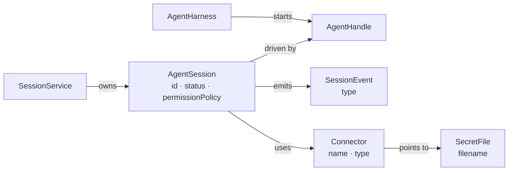
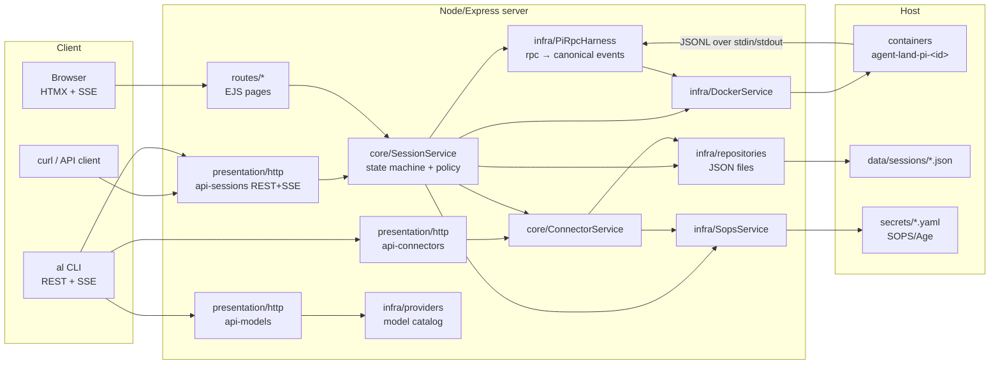
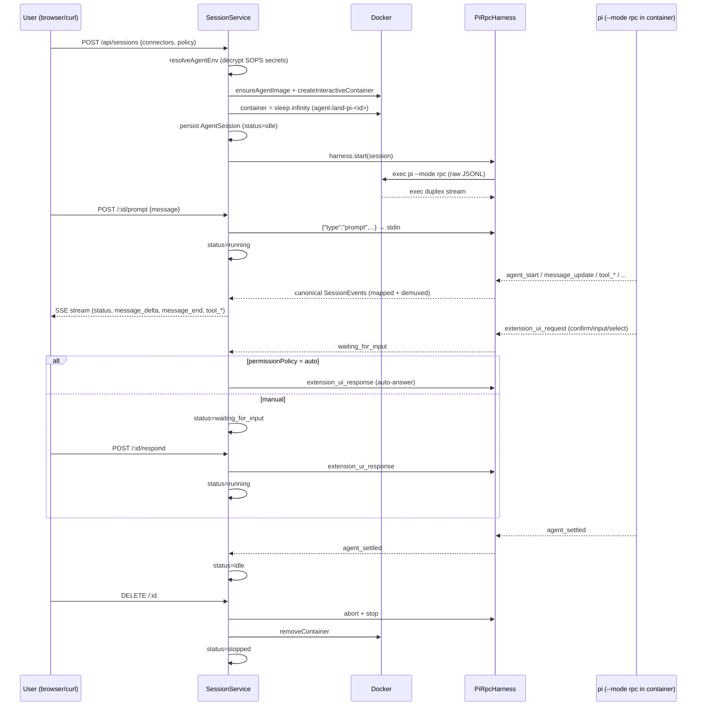
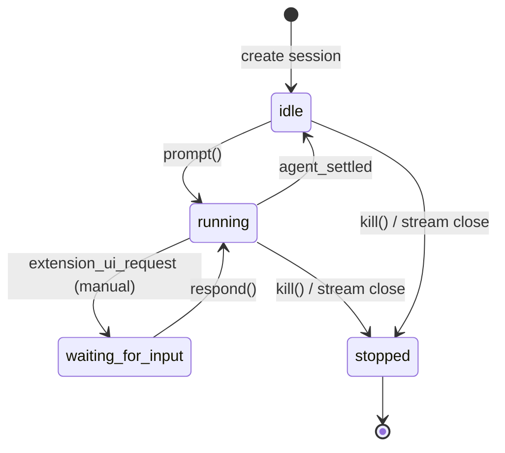

# Agent Land — Architecture

How a session flows through the refactored system. `core/` owns domain state, `infra/` implements ports, `presentation/` exposes the core over HTTP + SSE.

## Entities & relationships

- **`AgentSession`** — the single entity; one-shot = a session with `permissionPolicy: "auto"`.
- **`AgentHandle`** — live handle to the running pi process (prompt/respond/abort/stop).
- **`SessionEvent`** — canonical event stream consumed by SSE/HTML.
- **`Connector`** — pointer to an encrypted `SecretFile` (SOPS/Age), decrypted only at launch.
- **`SecretFile`** — SOPS/Age-encrypted credentials file mounted as env vars in the container.
- **`AgentHarness`** — port that spawns the handle; `PiRpcHarness` speaks JSONL to `pi --mode rpc`.
- **`SessionService`** — the single control surface: state machine, policy, and event fan-out.

## System architecture

## Life of a session

## State machine

