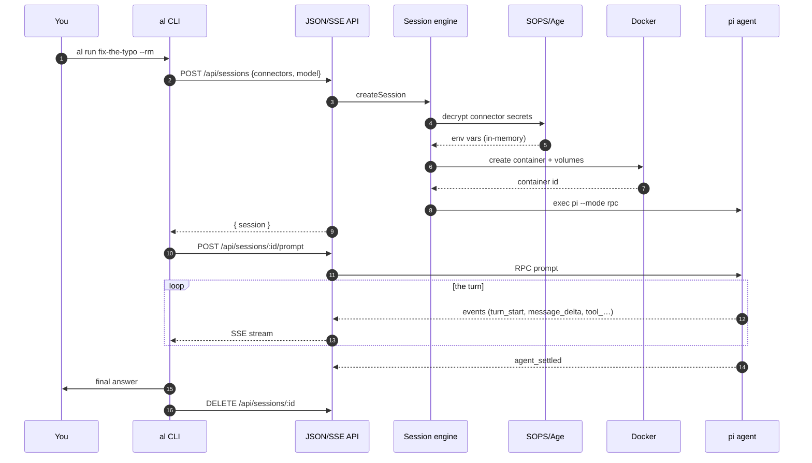
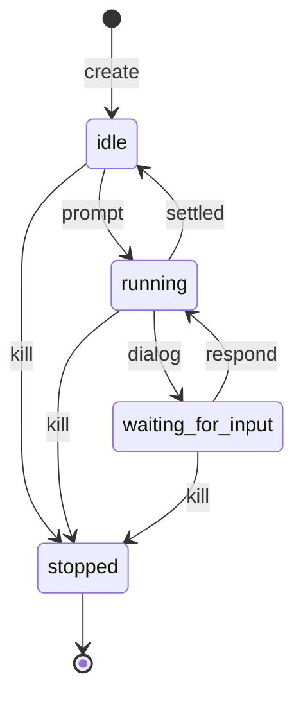
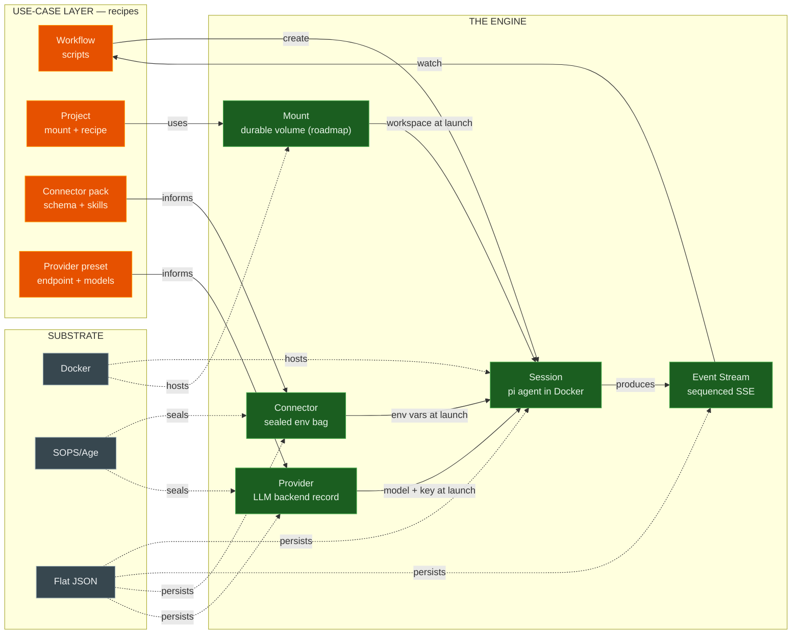
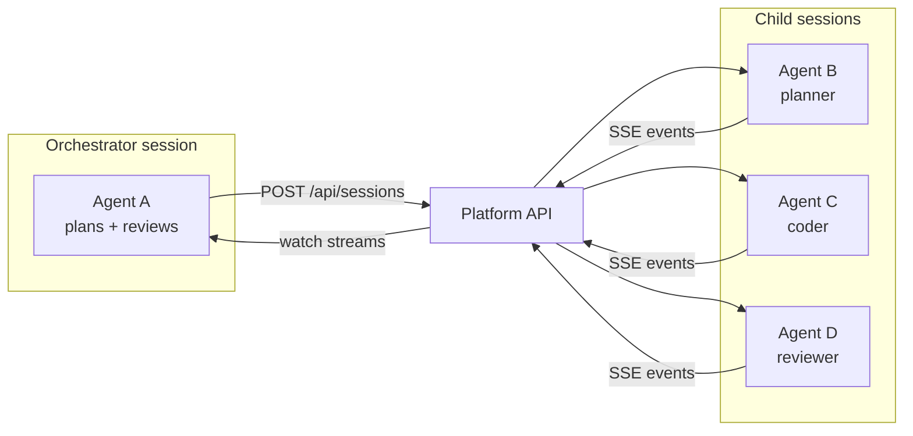
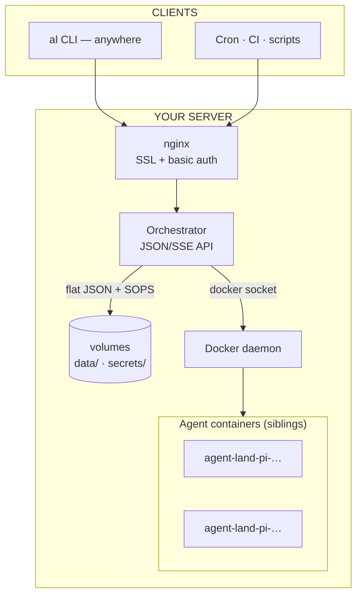

# Agent Land architecture — the zoom ladder

The same system at six scales. Everything here is a projection of the [engine](/knowledge/engine.md) — six primitives, three substrates, one opinion.

## Zoom in — one turn, concretely

Secrets are decrypted in-memory at launch and injected as container env vars — they never touch disk or the API.

## The atom — a session's lifecycle

The session is the atom of the platform — one `pi` agent in one container. Long-lived, re-attachable, durable across orchestrator restarts.

## The system — one diagram

Capabilities are injected at launch · sessions produce event streams · recipes watch streams and create sessions · substrate hosts, seals, and persists.

## Zoom out — the composition loop

Orchestration lives in the feedback loop, outside the engine. A workflow is a script that creates sessions, prompts them, watches their event streams, and reacts. Agent-driven looping (agents spawning agents) arrives with the Platform Connector; today the loop is driven externally via the CLI and the API.

## Zoom out — the platform on a server

Production is a `git push dokku main:master` that builds the Dockerfile and provisions SSL + nginx basic auth; local dev is `docker compose up --build -d`.

## Design invariants

1. **Registries outlive sessions.** Connectors, providers, mounts are catalogs; sessions reference but never mutate them.
2. **Create-time is resolution-time.** Env, engine config, and mounts are fixed when the session starts.
3. **The platform observes.** The event stream is the only observation channel; its vocabulary is agent-mechanical.
4. **Vendor knowledge and workflows stay in the composition layer.** Presets, packs, projects, workflows — recipes that build on the primitives.
