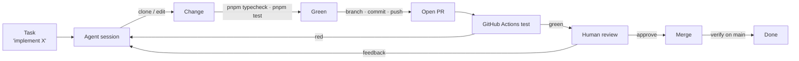

# Dogfooding — developing agent-land on agent-land

**One-liner:** Use Agent Land to build Agent Land — every feature an agent can run against this repo becomes real the day it lands, and every gap becomes a roadmap item.

## Why dogfood

Building the platform *with* the platform closes the loop:

- **Every feature is exercised by a real consumer** the moment it merges — no synthetic demos.
- **Gaps become concrete tickets**, not hypotheticals. If the agent can't open a PR, that's a roadmap item, not a footnote.
- **The product's own velocity is the metric.** The number of agent-land PRs produced by agent-land is the single best signal the platform works.
- **Trust builds gradually** — start with docs and refactors, earn merge rights, and only then consider deploy.

## The loop

The target end-state is a closed loop from task to merged, verified change:

The human is in the loop at **review** and (for now) **merge**. The agent owns everything left of review; everything right of it is earned.

## What works today vs the gaps

| Step | Today | Enabler / gap |
|------|-------|---------------|
| Clone the repo | ✅ Works — the agent clones into its per-session working directory as part of the prompt | — |
| Edit + run checks (`pnpm typecheck`, `pnpm test`) | ✅ Works — node/pnpm are pre-baked in the agent image | ✅ Done — `agent-image/Dockerfile` is `FROM node:22-slim` and installs `pnpm@11.8.0` |
| Branch / commit / push / open PR | ✅ Works — `gh` + the GitHub connector's `GITHUB_TOKEN` | — |
| Watch CI, react to red | ✅ Works — `gh pr checks` / `gh run watch` | A checked-in playbook so it's automatic, not ad-hoc |
| Respond to review comments | ✅ Works — `gh api` to read + reply | A trigger loop; today the human re-prompts |
| Split work across agents | ❌ Gap | [Platform Connector](product/features/platform-connector.md) + the [multi-agent roadmap](/multi-agent-workflow.md) |
| Recurring maintenance (release notes, deps) | ❌ Gap | Scheduled workflows (cron) — [multi-agent roadmap Phase 3](/multi-agent-workflow.md) |
| Merge after green CI + approval | ⚠️ Works (`gh pr merge`) but ungated | Keep human-gated until trust is earned |
| Deploy + verify live | ✅ Works — CI on merge to `main` pushes to Dokku and health-checks ([deploy.yml](../../../.github/workflows/deploy.yml)) | Merge stays human-gated |
| Agent image updates reach the host | ❌ Gap | `ensureAgentImage` only builds when the tag is absent — see [agent-image staleness](learnings/agent-image-staleness.md) |

## Roadmap

Phases are ordered by how much they exercise the current platform, not by ambition. Each phase is only "done" when the agent performs it on this repo in anger.

### Phase 0 — One-shot feature work (done 2026-09-05)

`al run` a feature task end-to-end: clone → edit → `pnpm typecheck` + `pnpm test` → branch → commit → push → open PR. Human reviews, merges, deploys.

- **Deliverable:** a real agent-land PR opened by agent-land (this repo). Achieved 2026-09-05 with [PR #43](https://github.com/marcoklein/agent-land/pull/43); the gaps it surfaced are logged in [First dogfooding run](/learnings/first-dogfooding-run.md).
- **Constraint:** start with low-risk work — docs, tests, refactors — before feature code.

### Phase 1 — Long-lived dev session

`al new` a session and iterate over multiple turns with `al chat`, keeping the checkout in the session's working directory across turns. The agent holds context; the human steers.

- **Deliverable:** a multi-turn feature built without restarting the session.
- **Exercises:** session durability, streaming, manual policy dialogs.

### Phase 2 — CI-aware loop (playbook checked in 2026-09-05)

Check in a **dev playbook** (a `SKILL.md` or `AGENTS.md` section) the agent always follows: branch → typecheck → test → commit → push → PR → `gh pr checks --watch` → re-push on red → report the result. No human nudge between red CI and the fix. The playbook is [`.opencode/skills/dev-playbook/SKILL.md`](../../../.opencode/skills/dev-playbook/SKILL.md); `AGENTS.md` points at it as the canonical contract.

- **Deliverable:** an agent that opens a PR *and* brings it to green before handing over.
- **Exercises:** long-running sessions, re-attach from a different machine.

### Phase 3 — Review response

The agent reads PR review comments (`gh api`), addresses them, replies, and requests re-review — all from a prompt like "respond to the review on PR #n".

- **Deliverable:** a PR that goes red → review → green → merge with the agent driving the middle.
- **Exercises:** multi-turn steering, event history replay.

### Phase 4 — Scheduled maintenance

Recurring work runs on its own: weekly release notes, dependency bumps, stale-PR triage. Depends on the scheduled-workflow milestone from [the product vision](product/goals/product-vision.md).

- **Deliverable:** a cron workflow that opens a maintenance PR every week without being asked.

### Phase 5 — Gated self-service (merge + deploy)

The agent merges after green CI + approval, then deploys to Dokku and verifies. Requires a deploy path (SSH/Dokku connector) and a hard human gate on merge/deploy — the agent *proposes*, the human *confirms*, until this phase proves itself.

- **Deliverable:** a full loop with the human approving at a single gate, not driving each step.
- **Risk gate:** deploy stays human until Phase 4 has run clean for weeks.

## Dogfooding rules

1. **Ship through the tool.** If a change to agent-land wasn't made by an agent-land session, ask why and log the blocker.
2. **Gaps are tickets.** Every "the agent can't X yet" becomes a roadmap item, not a workaround.
3. **Trust is earned, not granted.** Merge/deploy rights unlock by phase, not by assumption.
4. **The agent never deploys itself without a human gate.** Self-modifying a running platform is the one action that stays gated longest.

## Success signals

- **Fraction of agent-land PRs opened by agent-land** (target: majority after Phase 3).
- **Task → green PR time** — wall-clock from prompt to a PR that passes CI.
- **Red-CI self-recovery rate** — how often the agent fixes its own failures without a nudge.
- **Recurring work that needs no human** — maintenance PRs that just appear.

## Risks & mitigations

| Risk | Mitigation |
|------|------------|
| Agent breaks its own host (the platform code it runs on) | CI gates every change; human reviews and merges; deploy stays human until Phase 5 |
| Secret leakage through the loop | GitHub connector stays scoped; deploy credentials never enter the agent until a dedicated, minimal connector exists |
| Long sessions dying mid-task | Session lifecycle already survives redeploys ([learnings](learnings/session-lifecycle.md)); re-attach and continue |
| Agent quality regressions get hidden | Dogfooding *is* the regression test — a red loop is a product bug, not just a model limitation |

## Open questions

- What's the minimum deploy connector (SSH key vs. Dokku plugin) that keeps the agent's blast radius small enough for Phase 5?
- Does the dev playbook (Phase 2) live in the repo (`AGENTS.md`/`SKILL.md`) or as an agent-land role template once orchestration lands?
- At what point does a second agent (reviewer) make sense, and does that wait for the agent→agent channel? — the [multi-agent roadmap](/multi-agent-workflow.md) answers: a reviewer child lands with the static orchestrator (Phase 2), right after Platform Connector (Phase 1).
