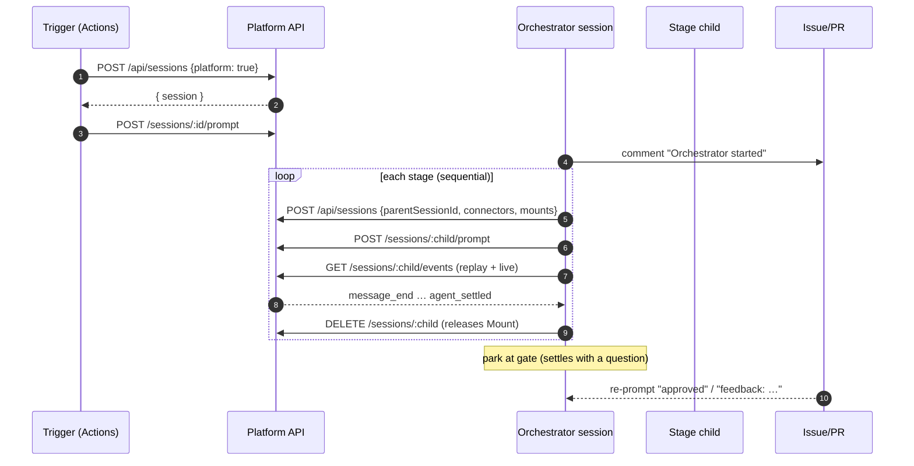
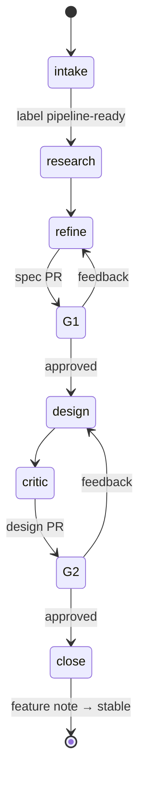

# Multi-agent pipeline architecture — the built system

This describes the *dogfooding product pipeline* as it is actually assembled and running, not the roadmap intent. It is a composition built on the [engine](/engine.md) primitives — nothing here adds a workflow executor to the engine; control flow lives in a recipe and a GitHub Actions trigger that shell out to the JSON/SSE API[^engine].

## The whole at one glance

```mermaid
graph TB
    subgraph human["HUMAN"]
        issue["Issue + `pipeline-ready` label"]:::outside
        gates["Gate reviews<br/>(approved / feedback)"]:::outside
    end

    subgraph gh["GITHUB"]
        cron["pipeline-trigger workflow<br/>cron (hourly) + dispatch"]:::trigger
    end

    subgraph plat["AGENT-LAND (hosted)"]
        api["JSON/SSE API<br/>+ auth middleware"]:::core
        orch["Orchestrator session<br/>(platform: true)"]:::core
        child1["research child"]:::core
        child2["refine child<br/>spec PR"]:::core
        child3["design child<br/>design PR"]:::core
        child4["critic child<br/>review"]:::core
    end

    issue --> cron
    cron -->|"list pipeline-ready,<br/>dedupe by markers"| issue
    cron -->|"POST /api/sessions (platform: true)<br/>POST prompt"| api
    api --> orch
    orch -->|"spawn children (parentSessionId)| api
    api --> child1 & child2 & child3 & child4
    orch -->|"post stage comments,<br/>open PRs"| issue
    child2 -->|"spec PR"| gh
    child3 -->|"design PR"| gh
    gates -->|"re-prompt gate outcome"| orch

    classDef core fill:#1b5e20,stroke:#4caf50,color:#e8f5e9
    classDef trigger fill:#4a2c88,stroke:#8e6fd1,color:#f0e8ff
    classDef outside fill:#e65100,stroke:#ff9800,color:#fff3e0
```

Six moving parts. Read them top-to-bottom as the flow of one issue.

## 1. Intake — an issue, not a UI

A human states the outcome as a **GitHub issue** and adds the **`pipeline-ready`** label. There is no intake agent, no form, no UI — the issue body *is* the requirements document, and the label *is* the "start me" signal[^pipeline][^trigger-learn].

- One issue = one pipeline run.
- `pipeline-ready` = eligible for the trigger.
- `rerun` = an override that re-runs an issue whose run already completed (the trigger's marker guard otherwise latches forever).

## 2. Trigger — the only "scheduled" part

`.github/workflows/pipeline-trigger.yml` runs hourly (`cron: 0 * * * *`) and on `workflow_dispatch`. It is a GitHub Actions job, not an agent-land session, so it authenticates to the platform as the **operator** via the `AGENT_LAND_URL` / `AGENT_LAND_BASIC_AUTH` repo secrets[^trigger-learn].

For each `pipeline-ready` issue it:

1. **Deduplicates** by scanning issue comments for the orchestrator's markers — `Orchestrator started` (in flight or done) and `Pipeline complete` (done) — and skips any issue carrying either, unless `rerun` is present.
2. **Discovers the GitHub connector** via `GET /api/connectors` (first entry whose `envKeys` includes `GITHUB_TOKEN`), because connectors resolve by exact name and a hardcoded guess resolves to *nothing* silently[^orch-learn].
3. **Creates a platform-enabled session** — `POST /api/sessions` with `{ connectors: [<github>], platform: true }` — and prompts it with the orchestrator's run instruction.

The trigger is deliberately dumb: one job, markers as the only state, no scheduler awareness beyond cron.

## 3. The orchestrator session — loopback client

The spawned session is `platform: true`, so the engine injects `AGENT_LAND_URL` and a **per-session ephemeral credential** (`AGENT_LAND_BASIC_AUTH=session-<id>:<token>`) into its container[^conn][^conn-design]. That credential authenticates only the JSON/SSE API and dies with the session — the loopback [Platform Connector](/product/features/platform-connector.md), the single primitive that turns the orchestrator into a first-class client of the platform.

The orchestrator runs the **static recipe** from `agent-image/skills/orchestrator/SKILL.md`: a fixed, deterministic stage list, sequential children, gates as parks. It decides *content* (stage prompts, summaries), never *control flow*[^orch-skill].



## 4. Stage children — one session per stage

Each stage is a **fresh child session** created via the API with `parentSessionId` set to the orchestrator, `platform: false` (children are platform-blind), the connector limited to what the stage needs, and — for note-writing stages — a `Mount` binding the repo checkout at `/data/agent-land`[^orch-skill].

Stages run **strictly sequentially** because the engine hard-enforces **at most one live session per Mount**; the orchestrator binds no Mount itself, and each child is `DELETE`d before the next is created[^engine].

| Stage | Child's job | Artifact |
|---|---|---|
| research | read the issue + repo docs, produce a brief | issue comment |
| refine | write the OKF `Feature` note, open the spec PR | **spec PR** (outcome gate) |
| design | write the `Design` note answering the feature's open questions | **design PR** (design gate) |
| critic | adversarially re-verify the design against the repo | review comment |

The parent/child relationship is recorded (`parentSessionId`) and visible as `al ls --tree` while a child is live; the durable trail is the issue comments + PRs, not the session tree[^orch-skill].

## 5. Gates — parks, not endpoints

The pipeline's three human gates (outcome, design, merge) become `waiting_for_input` parks. At each gate the orchestrator **ends its turn with a summary and exactly one question** and creates no further children; a re-prompt carrying `approved` resumes it, or `feedback: <notes>` re-runs the stage that produced the artifact[^pipeline].



Merging stays human-gated throughout — the agent proposes, a human (or a delegated master session) approves.

## 6. Auth — two identities, one middleware

Server-side auth for `/api/*` accepts exactly two identities[^conn-design]:

- the **operator** basic-auth credential (configured via `AGENT_LAND_BASIC_AUTH` env), and
- a **session** credential `session-<id>:<token>`, checked against the session record's `platformToken` (constant-time).

When no operator credential is configured, the deployment is trusted-network/reverse-proxy-fronted and every request passes through — the layout that lets nginx terminate TLS while the app enforces (or defers) auth[^loopback-learn].

## Where each concern lives

| Concern | Home |
|---|---|
| Engine primitives | `packages/server`, `packages/contracts` |
| Loopback credential + lineage | `session-service.ts` (mint/inject/revoke), `auth.ts` |
| The recipe (control flow) | `agent-image/skills/orchestrator/SKILL.md` |
| The schedule | `.github/workflows/pipeline-trigger.yml` |
| Product memory produced | `docs/knowledge/product/{features,designs}/*.md` |
| Operator credentials | GitHub Actions secrets + platform config |

The architecture's one hard rule, carried over from the design notes: **control flow stays outside the engine.** The engine gained one primitive (loopback env injection) and a lineage field; everything else — the stage list, the trigger, the gates — is a recipe and a cron that speak the JSON/SSE API[^engine][^roadmap].

[^engine]: [Agent Land engine](/engine.md)
[^roadmap]: [Multi-agent workflow roadmap](/multi-agent-workflow.md)
[^pipeline]: [The product pipeline](/product/pipeline.md)
[^conn]: [Platform Connector feature note](/product/features/platform-connector.md)
[^conn-design]: [Platform Connector design note](/product/designs/platform-connector-design.md)
[^orch-skill]: [Orchestrator recipe](agent-image/skills/orchestrator/SKILL.md)
[^trigger-learn]: [Scheduled pipeline trigger](/learnings/scheduled-pipeline-trigger.md)
[^loopback-learn]: [First loopback run](/learnings/first-loopback-run.md)
[^orch-learn]: [First orchestrated run](/learnings/first-orchestrated-run.md)
