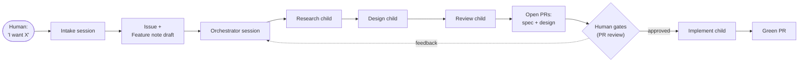

# Multi-agent workflow — from vision to review-ready PRs

**One-liner:** State an outcome to one agent; wake up to open PRs — a feature spec, a design note, and eventually the implementation — produced by a chain of dedicated agent sessions, with the human only at the gates.

## The end vision

A human describes a product vision conversationally. An **intake agent** refines it into an issue and a draft feature note. An **orchestrator agent** picks up the issue and fans the work out across dedicated child sessions — research, refine, design, review, implement — each a normal agent-land session with its own connectors and model. The orchestrator pauses at the human gates as `waiting_for_input` and resumes when the gate clears. The final form is **dynamic orchestration**: the orchestrator plans its own stage graph per task instead of following a fixed script.

This is the [product pipeline](/product/pipeline.md) running on the platform itself, and the "Split work across agents" gap in [dogfooding](/dogfooding.md) closed. Control flow stays a recipe *outside* the engine — the engine gains no workflow executor, only the [loopback](/engine.md#loopback) primitive that lets sessions compose[^archon].

## Phases

Phases are ordered by dependency, not ambition. Each is "done" only when it has run in anger on this repo.

### Phase 0 — Intake agent (no engine changes)

A long-lived `al new` session with the GitHub connector and the bundled `product` skill. The human describes the vision over multiple turns; the agent refines it into an OKF `Feature` note, creates a GitHub issue, and opens the spec PR (gate 1).

- **Deliverable:** issue + spec PR from one conversation.
- **Exercises:** dogfooding Phase 1 (multi-turn session durability).
- **Depends on:** nothing — works today.

### Phase 1 — Platform Connector (the keystone)

Implement [Platform Connector](/product/features/platform-connector.md): the engine injects `AGENT_LAND_URL` and scoped `AGENT_LAND_BASIC_AUTH` into session containers, so any agent can create, prompt, and watch child sessions through the existing JSON/SSE API.

Decisions taken for the roadmap (to be confirmed in the feature's design note):

- **Per-session ephemeral identity** — the injected credential dies with the session; no shared operator role inside containers.
- **Opt-in injection** — a session is platform-enabled explicitly (`al new --platform` / a field on session create); default off keeps the blast radius small.
- **Lineage** — session records gain `parent_session_id`, surfaced as `al ls --tree`, so a run reads as a tree of sessions, not a flat list.
- **Ergonomics** — a bundled skill teaches sessions the API (create → prompt → watch SSE → react to `agent_settled`).

- **Deliverable:** an orchestrator session that spawns a child, prompts it, and reports its result — on the platform, unprompted by a human mid-flight.
- **Dogfooded:** Phase 0's intake flow produces this feature's spec and design PRs.

### Phase 2 — Static orchestrator recipe

A platform-enabled orchestrator session runs the pipeline as a **fixed, deterministic stage list**: research → refine (spec PR) → design (design PR) → self-review (a reviewer child critiques before the human sees it). Stages run **sequentially**, each a fresh child session with a stage-specific prompt; the orchestrator only decides *content*, never *control flow*[^archon]. Gates are `waiting_for_input`: the orchestrator parks until the human re-prompts with the gate outcome.

Sequential stages respect the Mount single-writer invariant: the server hard-enforces at most one live session per Mount, so the repo checkout Mount is bound by **one stage child at a time** (the orchestrator itself binds no Mount — it coordinates via the JSON/SSE API), and each child is deleted before the next starts.

- **Deliverable:** one prompt ("run the pipeline on issue #N") → two open PRs (spec + design) plus a review summary from the critic child.
- **Recipe home:** the orchestrator's stage list lives as a skill in the agent image — `agent-image/skills/orchestrator/SKILL.md` — not in the server. The skill is the canonical Phase 2 recipe (stage prompts, exact `curl`/`jq` loops, gate mechanics, and a no-platform-injection fallback).

### Phase 3 — Scheduled trigger (cron first, webhooks later)

Remove the human nudge that *starts* and *resumes* the pipeline. The cheap first step needs no engine change: a **scheduled GitHub Actions workflow** (or host cron) runs a polling session that scans for issues labeled `pipeline-ready` and orchestrators parked at a cleared gate, and advances them. Once the polling loop proves the value, a follow-up may replace it with a **webhook endpoint** on the server (issue labeled → session created; PR reviewed → orchestrator re-prompted).

- **Deliverable:** label an issue → spec and design PRs appear with nobody at a terminal; review feedback on a design PR → revised design on the next poll.
- **Maps to:** dogfooding Phase 4 (scheduled maintenance).

### Phase 4 — Dynamic orchestration

The orchestrator stops following a fixed stage list and **plans the stage graph per task**: skips or deepens research, splits implementation into parallel children on per-child worktree mounts, spawns adversarial reviewers, retries failed stages with adjusted prompts, and picks models per stage (cheap for research, strong for design). The recipe becomes prompt-level policy — roles, tools, gates, budgets — instead of a scripted sequence.

- **Enablers:** parallel mounts/worktrees, per-child model selection (providers already support it), cost guardrails and the kill switch (ADR 011), session-tree observability from Phase 1.
- **Deliverable:** a task where the orchestrator's stage graph visibly differs from the default pipeline, with the quality to match.

## Cross-cutting rules

1. **Every phase dogfoods** — gaps become issues, not workarounds ([dogfooding rules](/dogfooding.md)).
2. **Merges stay human-gated** through all phases; implementation children only run once spec and design gates prove reliable.
3. **The engine stays minimal** — every phase is env injection, existing API, skills, and external schedules; nothing in Phases 0–4 asks the server to understand workflows.
4. **Trust ladder** — the reviewer child (Phase 2) is the first agent granted judgment over another agent's output; it advises, the human decides.

## Open questions

- Per-session identity: how does the server mint and revoke ephemeral credentials without a database (flat-JSON constraint, ADR 008)?
- Where does the orchestrator hold pipeline state across redeploys — the session's event history, the issue's comments, or both?
- Does the intake agent and the orchestrator merge into one session once Platform Connector lands, or stay separate roles?
