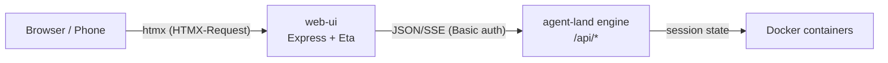

# Web UI

A browser-based dashboard that shows what the agents are doing — nothing more. The engine stays API-only; the web-ui is a separate Express app that talks to the engine via the JSON/SSE API, just like the CLI.

## Pages

| Route | Content |
|---|---|
| `/` | Dashboard: Needs-you (waiting sessions with gate prompt + last assistant message), Running / Idle / Stopped sections, Resource counts; auto-refresh every 10s via htmx polling |
| `/sessions/:id` | Session metadata, waitingFor block, last message |
| `/connectors` | Name, URL, env key names (values never leave the server) |
| `/providers` | ID, label, API dialect, base URL, models, enabled/disabled |
| `/mounts` | Name, created/updated timestamps |

## Architecture



The web-ui holds no state; every page render calls the engine's API. The last message for waiting sessions is fetched via SSE replay (quiet-stop after 500 ms, same pattern as `al status`) and cached in-memory keyed by `sessionId:updatedAt`.

## Running locally

```bash
pnpm dev:web                           # default: AGENT_LAND_URL=http://127.0.0.1:3000
AGENT_LAND_URL=https://agent-land.host.impromat.app \
  AGENT_LAND_BASIC_AUTH=user:pass \
  pnpm dev:web
```

## Deployment

The web-ui is a second Dokku app on the same host: `agent-land-ui.host.impromat.app`. It uses `Dockerfile.web` (set via `dokku builder-dockerfile:set agent-land-ui dockerfile-path Dockerfile.web`) and deploys via `.github/workflows/deploy-web.yml`. Host setup is IaC-managed in `personal-infra/apps/agent-land-ui.sh`. For deployment gotchas — nginx permissions, http-auth bootstrap, and the dockerfile-path property — see [deployment pitfalls](/learnings/deployment.md).

## Phase 2 backlog

- [ ] Respond/approve form (`POST /api/sessions/:id/respond` exists, UI missing)
- [ ] Abort/kill session button
- [ ] Live log view (hx-sse + engine SSE bridge — would revive ADR 013)
- [ ] ntfy.sh push notification on session → `waiting_for_input` transitions
- [ ] Session creation wizard
- [ ] Parent/child session tree view
- [ ] PWA manifest (home-screen icon)