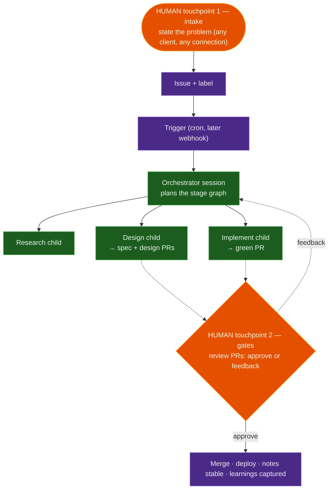
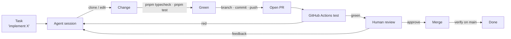

# Dogfooding — the agent-land playbook

**One-liner:** Build agent-land with agent-land, through the flagship playbook: state a problem, review PRs at gates — everything in between runs itself, on the platform being built.

The [vision](/product/goals/product-vision.md) separates the engine (neutral machinery that runs agents) from playbooks (opinionated ways of working on top). This note is **the agent-land playbook**: the first and flagship bundle of opinion, and simultaneously the platform's test bed — every feature is exercised by a real consumer the day it lands, and every gap becomes a roadmap item.

## Why dogfood

- **Every feature is exercised by a real consumer** the moment it merges — no synthetic demos.
- **Gaps become concrete tickets**, not hypotheticals. If the agent can't open a PR, that's a roadmap item, not a footnote.
- **The product's own velocity is the metric.** The number of agent-land PRs produced by agent-land is the single best signal the platform works.
- **Trust builds gradually** — start with docs and refactors, earn merge rights, and only then consider deploy.

## The playbook inventory

What the agent-land playbook bundles today — all of it composition; none of it in the engine:

| Piece | What it carries | Home |
|---|---|---|
| Product pipeline | outcome → Feature note → Design note → green PR, with gates | [/product/pipeline.md](/product/pipeline.md) |
| OKF product memory | the notes the pipeline reads and writes | `docs/knowledge/product/` |
| Orchestrator recipe + policy | dynamic stage planning, budgets, gate discipline | `agent-image/skills/orchestrator/` |
| HITD recipe | phase contract + handoff protocol (see below) | operator skill — **to port**; landing shape proposed by the [ticket loop](/playbook/ticket-loop.md#handoff-contract--the-hitd-port) |
| Dev loop | branch → checks → PR → green loop | `.opencode/skills/dev-playbook/` (legacy name — a recipe, not a playbook) |
| Trigger | hourly scan for `pipeline-ready` issues | `.github/workflows/pipeline-trigger.yml` |
| Ticket loop (concept) | the heartbeat: one stateless prompt advancing every ticket by one step per tick, fresh context per step | [/playbook/ticket-loop.md](/playbook/ticket-loop.md) — planned |
| Ticket layer | the queue's system of record: `agent-land-tickets` git repo (`tk`), phase-label funnel, per-ticket HITD artifacts + thoughts, reconciliation | [/product/designs/ticket-layer-design.md](/product/designs/ticket-layer-design.md) — v1 live ([ADR 019](/adrs/019-ticket-layer-git-synced-repo.md)); initial tickets created, loop driver next |
| Clients | `al` CLI today; thin conversational client planned | `packages/cli` |

Structural intent (not yet physical): the playbook consolidates into a single monorepo package (`packages/playbook`), so the vision's swappability claim is folder-visible — today the pieces sit where they grew. With the move, the `dev-playbook` skill renames to `dev-loop` (it is a recipe by the [glossary](/product/goals/product-vision.md#the-two-layers); "playbook" stays unambiguous).

## The operator model — two touchpoints

The operator's day shrinks to two moments; everything else is the engine and the playbook:

1. **Intake** — state the problem, from anywhere, on any connection: an issue, the CLI, or (planned) a thin conversational client against the hosted API. The server holds all state, so a dropped connection costs nothing — clients re-attach and the event feed replays what happened while you were in the tunnel.
2. **Gate review** — approve or send feedback where the playbook parks: spec PR, design PR, merge. Reviewing a PR *is* the interaction; the [Web UI](/platform/web-ui.md) shows which sessions are waiting on you, no terminal required.

Green is engine, purple is playbook, orange is human. Remove the purple and the green still runs someone else's workflow — that separation is the point[^product-vision].

A **thin conversational client** (small web app or similar) is planned as the intake touchpoint's friendliest form. Per ADR 016 it is a *separate consumer* of the JSON/SSE API — presentation never moves into the engine.

## HITD — the canonical recipe to port

HITD (Human in the Design) is the operator's proven single-task workflow: Question → Research → Design → **Human approval** → Structure → Plan → Implement → Verify, with artifacts (`task.md` … `plan.md`) and a strict handoff/status protocol (`HITD_HANDOFF_V1`, `STATUS: COMPLETED | PROGRESS | BLOCKED | …`)[^hitd]. It maps almost 1:1 onto the [product pipeline](/product/pipeline.md) stages the platform already runs[^pipeline]:

| HITD phase | On agent-land | Status |
|---|---|---|
| Question | intake conversation / issue body | exists |
| Research | research child | exists |
| Design | design child → design PR | exists |
| Human approval | design gate (PR review) | exists |
| Structure · Plan | planner (`plan.json` + `policy.yaml`) | exists (Phase 4) |
| Implement | build child → green PR | exists |
| Verify | CI + critic child | exists |
| Artifact + handoff contract | `docs/plans/hitd/<id>/*.md`, `HITD_HANDOFF_V1`, STATUS protocol | **to port** |

What's missing is not engine capability but the recipe's contract layer: durable artifacts on a mount and the phase handoff protocol. **Open question:** port HITD *into* the product pipeline recipe (one recipe, artifact dir alongside OKF notes) or keep it as a sibling recipe for single-task work — decided when the port is specced, not here. The [ticket loop](/playbook/ticket-loop.md) concept proposes an answer: the port lands as the sibling heartbeat recipe, with the artifact ladder on per-ticket branches and `HITD_HANDOFF_V1` as the orchestrator↔child protocol.

## The loop

The target end-state is a closed loop from task to merged, verified change:

The human is in the loop at **review** and (for now) **merge**. The agent owns everything left of review; everything right of it is earned.

## What works today vs the gaps

| Step | Today | Enabler / gap |
|------|-------|---------------|
| Clone the repo | ✅ Works — the agent clones into its per-session working directory as part of the prompt | — |
| Edit + run checks (`pnpm typecheck`, `pnpm test`) | ✅ Works — node/pnpm are pre-baked in the agent image | ✅ Done — `agent-image/Dockerfile` is `FROM node:22-slim` and installs `pnpm@11.8.0` |
| Branch / commit / push / open PR | ✅ Works — `gh` + the GitHub connector's `GITHUB_TOKEN` | — |
| Watch CI, react to red | ✅ Works — `gh pr checks` / `gh run watch` | A checked-in playbook so it's automatic, not ad-hoc |
| Respond to review comments | ✅ Works — `gh api` to read + reply | A trigger loop; today the human re-prompts |
| Split work across agents | ✅ Works (2026-09-05) | [Platform Connector](/product/features/platform-connector.md) live: `platform: true` sessions spawn children via the API; see [first loopback run](/learnings/first-loopback-run.md) and the [multi-agent roadmap](/playbook/multi-agent-workflow.md) |
| Recurring maintenance (release notes, deps) | ⚠️ Partial | [Pipeline trigger](/learnings/scheduled-pipeline-trigger.md) runs hourly for `pipeline-ready` issues; generic maintenance crons still open — [multi-agent roadmap Phase 3](/playbook/multi-agent-workflow.md) |
| Merge after green CI + approval | ⚠️ Works (`gh pr merge`) but ungated | Keep human-gated until trust is earned |
| Deploy + verify live | ✅ Works — CI on merge to `main` pushes to Dokku and health-checks ([deploy.yml](../../../.github/workflows/deploy.yml)) | Merge stays human-gated |
| Agent image updates reach the host | ❌ Gap | `ensureAgentImage` only builds when the tag is absent — see [agent-image staleness](/learnings/agent-image-staleness.md) |
| Watch a long unattended run | ⚠️ Partial | pi's `compaction_start/end` and `auto_retry_start/end` events are dropped by the harness — a compacting or retrying session looks hung. Project them into the event stream (mechanical, invariant-safe) |
| Know a session's cost / context fill | ❌ Gap | pi's `get_session_stats` (tokens, cost, context %) is unused; expose via `al status` for budget guardrails ([kill switch](/adrs/011-kill-switch.md)) |

## Roadmap

Phases are ordered by how much they exercise the current platform, not by ambition. Each phase is only "done" when the agent performs it on this repo in anger.

### Phase 0 — One-shot feature work (done 2026-09-05)

`al run` a feature task end-to-end: clone → edit → `pnpm typecheck` + `pnpm test` → branch → commit → push → open PR. Human reviews, merges, deploys.

- **Deliverable:** a real agent-land PR opened by agent-land (this repo). Achieved 2026-09-05 with [PR #43](https://github.com/marcoklein/agent-land/pull/43); the gaps it surfaced are logged in [First dogfooding run](/learnings/first-dogfooding-run.md).
- **Constraint:** start with low-risk work — docs, tests, refactors — before feature code.

### Phase 1 — Long-lived dev session

`al new` a session and iterate over multiple turns with `al chat`, keeping the checkout in the session's working directory across turns. The agent holds context; the human steers.

- **Deliverable:** a multi-turn feature built without restarting the session.
- **Exercises:** session durability, streaming, manual policy dialogs.

### Phase 2 — CI-aware loop (playbook checked in 2026-09-05)

Check in a **dev playbook** (a `SKILL.md` or `AGENTS.md` section) the agent always follows: branch → typecheck → test → commit → push → PR → `gh pr checks --watch` → re-push on red → report the result. No human nudge between red CI and the fix. The playbook is [`.opencode/skills/dev-playbook/SKILL.md`](../../../.opencode/skills/dev-playbook/SKILL.md); `AGENTS.md` points at it as the canonical contract.

- **Deliverable:** an agent that opens a PR *and* brings it to green before handing over.
- **Exercises:** long-running sessions, re-attach from a different machine.

### Phase 3 — Review response

The agent reads PR review comments (`gh api`), addresses them, replies, and requests re-review — all from a prompt like "respond to the review on PR #n".

- **Deliverable:** a PR that goes red → review → green → merge with the agent driving the middle.
- **Exercises:** multi-turn steering, event history replay.

### Phase 4 — Scheduled maintenance

Recurring work runs on its own: weekly release notes, dependency bumps, stale-PR triage. Depends on the scheduled-workflow milestone from [the product vision](/product/goals/product-vision.md).

- **Deliverable:** a cron workflow that opens a maintenance PR every week without being asked.

### Phase 5 — Gated self-service (merge + deploy)

The agent merges after green CI + approval, then deploys to Dokku and verifies. Requires a deploy path (SSH/Dokku connector) and a hard human gate on merge/deploy — the agent *proposes*, the human *confirms*, until this phase proves itself.

- **Deliverable:** a full loop with the human approving at a single gate, not driving each step.
- **Risk gate:** deploy stays human until Phase 4 has run clean for weeks.

## Dogfooding rules

1. **Ship through the tool.** If a change to agent-land wasn't made by an agent-land session, ask why and log the blocker.
2. **Gaps are tickets.** Every "the agent can't X yet" becomes a roadmap item, not a workaround.
3. **Trust is earned, not granted.** Merge/deploy rights unlock by phase, not by assumption.
4. **The agent never deploys itself without a human gate.** Self-modifying a running platform is the one action that stays gated longest.
5. **The playbook is composition.** Nothing this note describes may leak into the engine — recipes, gates, and clients speak the public API like everyone else.

## Success signals

- **Fraction of agent-land PRs opened by agent-land** (target: majority after Phase 3).
- **Task → green PR time** — wall-clock from prompt to a PR that passes CI.
- **Red-CI self-recovery rate** — how often the agent fixes its own failures without a nudge.
- **Recurring work that needs no human** — maintenance PRs that just appear.
- **Touchpoint time** — how little of the operator's day is intake + gate review (the rest should be the platform's job).

## Risks & mitigations

| Risk | Mitigation |
|------|------------|
| Agent breaks its own host (the platform code it runs on) | CI gates every change; human reviews and merges; deploy stays human until Phase 5 |
| Secret leakage through the loop | GitHub connector stays scoped; deploy credentials never enter the agent until a dedicated, minimal connector exists |
| Long sessions dying mid-task | Session lifecycle already survives redeploys ([learnings](/learnings/session-lifecycle.md)); re-attach and continue |
| Agent quality regressions get hidden | Dogfooding *is* the regression test — a red loop is a product bug, not just a model limitation |

## Open questions

- What's the minimum deploy connector (SSH key vs. Dokku plugin) that keeps the agent's blast radius small enough for Phase 5?
- Does the dev playbook (Phase 2) live in the repo (`AGENTS.md`/`SKILL.md`) or as an agent-land role template once orchestration lands?
- At what point does a second agent (reviewer) make sense, and does that wait for the agent→agent channel? — the [multi-agent roadmap](/playbook/multi-agent-workflow.md) answers: a reviewer child lands with the static orchestrator (Phase 2), right after Platform Connector (Phase 1).
- HITD port: merge into the product pipeline recipe, or sibling recipe for single-task work?

[^product-vision]: [Agent Land product vision](/product/goals/product-vision.md) — the engine/playbook split
[^pipeline]: [The product pipeline](/product/pipeline.md) — outcome → Feature note → Design note → green PR, with gates
[^hitd]: HITD workflow skill — operator opencode config (`skills/hitd-workflow/SKILL.md`): artifact set, human boundary at design approval, `HITD_HANDOFF_V1` handoff and STATUS protocol
