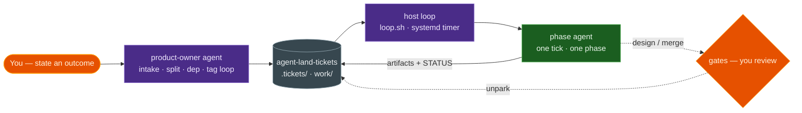

# Product owner — the intake touchpoint

The operator's day is two moments: **intake** and **gate review**. Intake used to mean running `tk create` by hand. Now it is a **product-owner agent** — a session you start, tell your outcomes, and it writes the tickets. The loop does the rest.



## Start the product-owner agent

The `product-owner` skill is baked into the agent image, so **one persistent session is your whole intake**. Start it once, then chat over many turns:

```bash
al new                          # pick provider/model, and the GitHub connector ("GitHub Personal All Repos"), then:
#   you> you are the product owner
#   you> here are my outcomes: add a health-check endpoint; make "al board" group by phase
```

Each turn the agent refines whatever you give it into loop-ready tickets — `tk create` with `loop,needs-refinement`, splits epics, wires deps — and pushes them to `agent-land-tickets`. It reports the ticket ids back. The loop then advances them phase by phase; you only re-enter at the two gates.

One-shot (no chat): `al run "you are the product owner: …" --connectors "GitHub Personal All Repos"`.

## The loop runs on the host

`scripts/loop.sh` runs unattended on the server as a systemd timer, not on your laptop — see `deploy/` in `agent-land-tickets` for the units and setup. One tick every few minutes: pull, pick the next ready `loop` ticket, spawn one fresh agent, retag the phase.

## Your two touchpoints

1. **Intake** — state outcomes to the product-owner agent (or drop a ticket directly: `tk create … --tags "loop,needs-refinement"`).
2. **Gate review** — approve at design (PR on the OKF note) and merge (implementation PR). The loop parks at both as `human`; you unpark by removing the tag.

Everything between is the platform's job. Tickets are the only state you touch.

[^ticket-loop]: [Ticket loop](/playbook/ticket-loop.md)
[^ticket-layer]: [Ticket layer](/product/designs/ticket-layer-design.md)
