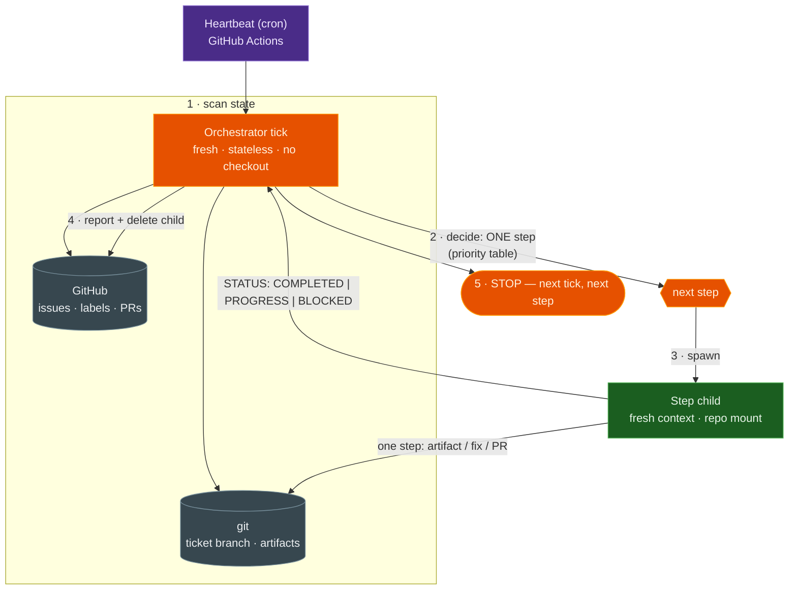
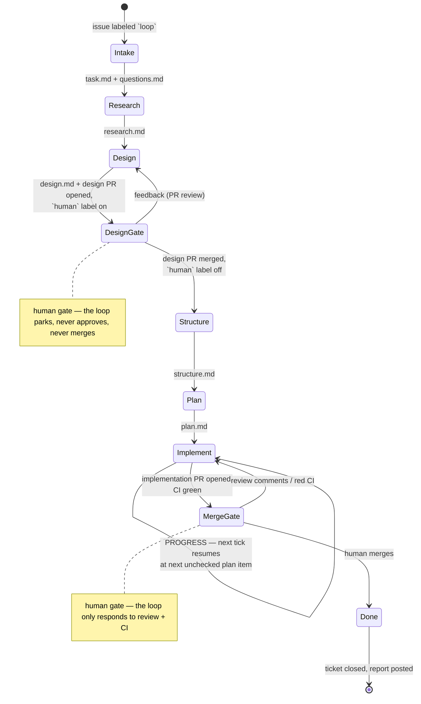

# Ticket loop — the dogfooding heartbeat

**One-liner:** One prompt, run forever: every tick scans all open tickets, picks the single most pressing next step, spawns a *fresh* agent to execute it, reports, and stops — all state lives in git and GitHub, never in an agent's context.

> **Status: conception.** This note captures the pattern at the concept level. Nothing here is implemented yet — no skill, no workflow, no labels. The planned artifacts are listed in [Shape of the landing](#shape-of-the-landing-when-it-comes).

## Why a loop next to the pipeline

The [product pipeline](/product/pipeline.md) is **per-issue and stateful**: one orchestrator session owns an issue end-to-end, plans a stage graph, holds budgets, and parks as `waiting_for_input` at gates[^architecture]. That works, but the orchestrator's lifetime *is* the ticket's lifetime — a long-lived session that must survive stalls, redeploys, and weeks of gate parking.

The ticket loop inverts this. It is the **heartbeat**: a stateless tick that asks one question — *given everything open right now, what is the single next step?* — executes it through a fresh child, and dies. The pattern is proven prior art: catchme5 ran a game project for months on exactly one prompt ("execute EXACTLY ONE step per session, then STOP") driven by a cron spawner[^catchme5].

| | Product pipeline | Ticket loop |
|---|---|---|
| Unit of work | one issue, end-to-end | one *step*, across all tickets |
| State | orchestrator session (parked at gates) | git artifacts + GitHub (issues, labels, PRs) |
| Context | accumulates over the run | fresh per step |
| Lifetime | as long as the ticket | seconds to minutes per tick |
| Crash recovery | resume/re-prompt the orchestrator | nothing to recover — the next tick re-derives state |
| Driver | `pipeline-trigger.yml` (one orchestrator per labeled issue) | heartbeat cron (one tick, repeated) |

The two coexist and cross-pollinate: the loop is the continuous driver of everyday ticket flow; the pipeline remains the heavy, budgeted treatment for a single large outcome. Long term the loop could even *spawn* a pipeline orchestrator as one of its steps when a ticket deserves it.

## The pattern

Three roles, none of them new to the engine:

1. **Heartbeat** — an external cron (GitHub Actions, like [`pipeline-trigger.yml`](../../../.github/workflows/pipeline-trigger.yml)) that spawns one orchestrator session per tick. External schedule, public API: "humans, crons, and agents are peer clients" — no engine change[^dogfooding].
2. **Orchestrator tick** — a platform-enabled session with *no repo checkout*. It scans ticket state through the backend (GitHub), decides the one next step by a fixed priority table, spawns a step child, watches it settle, posts the step report, deletes the child, and stops.
3. **Step child** — a fresh session bound to the repo mount with the GitHub connector. It receives a single-step handoff, does exactly that step, commits and pushes its artifacts, and answers with a STATUS block.



Because every tick re-derives state from durable stores, the loop is **crash-proof by construction**: a dead child, a killed orchestrator, or a skipped tick costs nothing — the next tick simply sees the same world and decides again.

## State model — the artifact ladder

A ticket's state is not a field; it is **which artifacts exist** on its work branch. The ladder follows the HITD sequence[^hitd]:

```
task.md + questions.md → research.md → design.md → structure.md → plan.md → code (PR)
```

- **Registry:** a GitHub issue is a ticket; the `loop` label opts it into the loop (intake stays the operator's first touchpoint[^dogfooding]).
- **Work branch:** one branch per ticket (`hitd/<issue>-<slug>`) carrying `docs/plans/hitd/<id>/` artifacts *and*, later, the implementation. Every step commits and pushes — the branch is the durable state and the audit trail.
- **Multi-tick implementation:** `plan.md` carries verification checkboxes; a step child that runs out of window answers `PROGRESS` with the next unchecked item, and the following tick's child resumes exactly there[^hitd].



## Decision rule — one step per tick

The orchestrator scans in a fixed priority order and acts on the **first match** (catchme5's discipline[^catchme5]): keeping already-open work flowing beats starting new work.

| # | Observed state | Step spawned |
|---|---|---|
| 1 | Implementation PR has unresolved review comments | child: address feedback, push |
| 2 | Implementation PR has red CI | child: fix CI, push |
| 3 | Implementation PR merged | child: close ticket — summary, issue closed, branch cleaned |
| 4 | Design gate cleared (PR merged, `human` off) | child: next ladder rung — `structure.md`, then `plan.md`, then implement |
| 5 | Ticket parked (`human` label or open design PR) | skip — human's turn |
| 6 | Ticket mid-ladder | child: produce the next artifact (at `design.md`: open the design PR, park) |
| 7 | New `loop` issue without a branch | child: start ticket — branch, `task.md`, `questions.md` |

Within the same priority, oldest ticket first. Exactly **one child per tick** — the loop's throughput comes from tick frequency, not from parallelism inside a tick (v1; see open questions).

## Human gates

Both gates stay human, per the trust ladder ("merge rights are earned, not granted")[^dogfooding]:

- **Design gate** — a PR on the artifacts; merge = approval. The child parks the ticket with the `human` label; only the human removes it.
- **Merge gate** — the implementation PR. The loop may *respond* to review comments and fix red CI, but it never approves, never merges, never bypasses.

The loop's relationship to a gate is always: *advance work up to the gate, park, report, move on to another ticket.* It never waits — waiting is what the next tick is for.

## Handoff contract — the HITD port

Orchestrator → child handoffs use the HITD protocol verbatim[^hitd]: a `HITD_HANDOFF_V1` block (phase, work directory, expected inputs/outputs, continuation instructions) and a structured answer (`STATUS: COMPLETED | PROGRESS | BLOCKED` + artifacts + next item). This closes the "Artifact + handoff contract — **to port**" row of the [dogfooding playbook](/playbook/dogfooding.md#hitd--the-canonical-recipe-to-port): the port lands as a playbook-level recipe, with durable artifacts on the ticket branch instead of a local mount.

## Concurrency and idempotency — no engine changes

- **Tick mutex:** the orchestrator binds a dedicated lock mount (`ticket-loop`). The server already hard-enforces *at most one live session per mount*[^architecture] — an overlapping tick's session creation simply fails, and the heartbeat skips. The engine's own invariant is the mutex.
- **Stale guard:** each heartbeat first deletes any previous, settled orchestrator session still holding the lock mount, so a crashed run cannot wedge the loop.
- **Step idempotency:** state is derived from committed artifacts and GitHub objects, never from "what the last tick intended". A step that died mid-flight is re-derived and re-attempted; the step report comment on the issue makes every attempt visible.

## Generalization seam (deliberately thin)

GitHub is **backend #1**, not the assumption. The recipe will isolate every backend command in a single "ticket backend" section, so the verbs — *list tickets, read state, park, check gate, comment, claim* — can later grow a second implementation (file-based `.tickets/` markdown, Jira, …) without touching the kernel. Per the dogfooding rule "the playbook is composition", this stays prompt-level for now; the seam is extracted into a real adapter contract only when a second backend actually appears. Likewise, the heartbeat is an external cron today; an **engine-native scheduler** (schedules as a resource beside mounts and connectors) is a candidate product feature — and a fitting *first ticket for the loop to build itself*.

The file-based `.tickets/` backend is now designed: the [ticket layer](/product/designs/ticket-layer-design.md) makes **agent-land-tickets** (a separate git-synced `tk` repo) the system of record ([ADR 019](/adrs/019-ticket-layer-git-synced-repo.md)) — `list/read state` = `tk ready`/`tk ls -T`, `claim` = `tk start` + git push, `park`/`check gate` = the `human` tag + `external-ref` PR status.

## Shape of the landing (when it comes)

Planned artifacts, all playbook-level, none in the engine:

| Piece | Home |
|---|---|
| Loop recipe (kernel + GitHub backend section + child prompt templates) | `agent-image/skills/ticket-loop/SKILL.md` |
| Heartbeat workflow (cron + dispatch, lock-mount spawn, stale guard) | `.github/workflows/ticket-loop.yml` |
| Labels `loop`, `human`; lock mount `ticket-loop` | one-time operator setup |
| First ticket: engine-native scheduler | a `loop`-labeled issue |

## Open questions

- **Cadence** — every 30 minutes is the starting guess; tick cost (one orchestrator + one child) sets the floor.
- **Ordering within a priority** — oldest-first is the v1 rule; a `priority` label may come later.
- **Multiple children per tick** — v1 is strictly one step per tick; parallel steps need per-child mounts (the pipeline already has that pattern) and a sharper mutex story.
- **Convergence with the pipeline** — does the loop eventually *replace* per-issue orchestrators by spawning one as a step, or do both stay side by side? Decided by evidence once the loop has run in anger.

[^dogfooding]: [Dogfooding — the agent-land playbook](/playbook/dogfooding.md) — engine/playbook split, trust ladder, operator model
[^pipeline]: [The product pipeline](/product/pipeline.md) — outcome → Feature note → Design note → green PR, with gates
[^architecture]: [Multi-agent pipeline architecture](/playbook/multi-agent-architecture.md) — the built system, incl. the Mount single-writer invariant
[^hitd]: HITD workflow skill — operator opencode config (`skills/hitd-workflow/SKILL.md`): artifact ladder, `HITD_HANDOFF_V1`, STATUS protocol
[^catchme5]: catchme5 `prompt.txt` + `docs/agent-orchestration.md` — single-prompt one-step-per-session loop driven by a cron orchestrator (operator's prior project)
