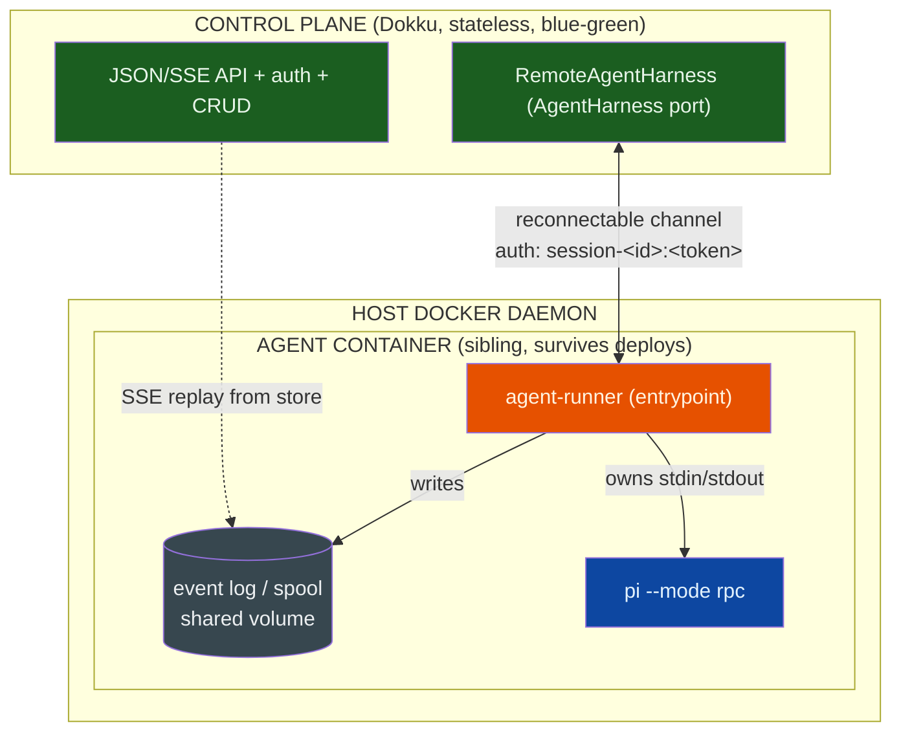

# Self-hosting sessions — session runtime ownership in the agent container

## Problem

Every merge to `main` deploys the platform. The agent containers survive — they are
siblings on the host Docker daemon[^adr-002] — but the **platform process owns pi's
`docker exec` stdio stream**[^pi-rpc]. When it restarts, the stream hits EOF and pi
exits mid-turn. Containers, transcripts, and mounts survive, and `recover()` re-attaches
with the same conversation[^ses-lifecycle] — but the in-flight turn and the client
connection are lost. Today this is absorbed by hand ("wait out the deploy wave"; "resume,
don't restart")[^self-deploy]. A headless loop that runs *while the platform is actively
developed* cannot absorb it: its step children are platform sessions that die mid-phase.

## Goal

A platform deploy — any merge — leaves every running session's pi process, its in-flight
turn, and its event stream uninterrupted.

## Non-goals

- Surviving a host / Docker-daemon restart (containers die; resume still applies).
- Multi-user auth or tenancy.
- Changing the agent runtime (`pi`) or the public JSON/SSE client surface.

## Principle

**The control plane is stateless and freely deployable; a session's execution owns itself
inside its container; the durable store is the only shared truth.** This completes
`session-lifecycle`'s rule — *"the host owns the session; the web process only attaches to
it"*[^ses-lifecycle] — by moving the one non-disposable thing (the pi stream) out of the
disposable process.

## Target architecture

- **Control plane** — HTTP/JSON/SSE API, session/connector/provider/mount CRUD, auth, SSE
  relay. Holds **no** pi streams and **no** in-memory session handles.
- **Agent runner** — a process inside the agent container that owns pi's stdin/stdout, maps
  pi-RPC → `SessionEvent`, writes the durable event log/spool to the shared volume, and
  holds a reconnectable channel to the control plane.
- **Durable store** — unchanged substrate: event logs, transcripts, session records, mounts.

## Interfaces

### `AgentHarness` port — unchanged

`start(session) → AgentHandle { events, prompt, respond, abort, stop }`[^harness] stays the
engine's contract. The change is a **new implementation** (`RemoteAgentHarness`) behind the
same port; `pi --mode rpc` remains the reference runtime[^engine]. This is exactly the
"alternative runtimes are earned through the same port" seam.

### Runner channel — engine-internal

- **Transport.** The runner **dials out** to the control plane (WebSocket, or SSE downstream
  + POST upstream). Outbound is NAT-friendly and lets the runner survive control-plane
  restarts.
- **Auth.** The session credential `session-<id>:<token>` — the runner is a platform client
  like any session (invariant #5), so no new identity is introduced.
- **Messages.** `register`, `event`, `command(prompt|respond|abort)`, `heartbeat`, `ack/seq`.
- **Replay.** The runner owns the durable log/spool; on reconnect it replays from the last
  acked sequence. The control plane re-derives state from the store + live channel.
- **Not a public surface.** No new `/api` route; this is intra-engine transport, not a fifth
  client surface[^boundary].

### Lifecycle changes

- **Create** — container entrypoint becomes the runner (replacing the current
  `Entrypoint: ["/bin/sleep"], Cmd: ["infinity"]` override[^docker]); the session credential
  and `AGENT_LAND_URL` are already injected.
- **`recover()`** — reconcile durable records + accept runner (re)registrations; no pi re-exec.
- **`drainAll()`** — no session drain on control-plane shutdown; close HTTP only.
- **Deploy** — the control plane is stateless, so zero-downtime blue-green is trivially
  correct.

## Rollover semantics

| Change | Effect on a running session |
|---|---|
| `packages/**` (control plane) merge | **none** — stateless swap; runner keeps pi alive |
| `agent-image/**` merge | **none** for running (old runner version); new sessions get the new runner |
| Control-plane crash | **none** — same as a deploy |
| Runner / pi crash | resume (existing `recover` behaviour) |
| Host / Docker-daemon restart | session dies — out of scope, resume applies |

## Migration (incremental, no big bang)

The `AgentHarness` port is the seam; every phase ships independently.

- **P0 — interim.** `drainAll` lets the current turn finish (bounded) and auto-resumes on
  boot. Removes most pain now; no ADR required.
- **P1 — seam.** Define the runner protocol + `RemoteAgentHarness`; add the runner to the
  agent image behind a flag; run both harnesses in parallel.
- **P2 — reconcile.** Make `recover()`/`drainAll()` transport-agnostic; serve SSE from the
  channel + durable replay.
- **P3 — cutover.** Runner as default; blue-green control-plane deploy; **prove a merge
  mid-turn leaves a session uninterrupted.**
- **P4 — cleanup.** Remove the exec harness for pi; content-hash the agent image (so new
  runner versions actually reach new sessions[^staleness]); update docs.

## Architecture fit

- **No new primitive.** Composes the six primitives[^engine]; only the `Session` primitive's
  *realization* moves.
- **Lands on the declared seam** — the `AgentHarness` port.
- **Strengthens invariants** — observation stays event-stream-only (#3); the runner is itself
  a platform client (#5).
- **Consistent with ADR 002** — leans on sibling containers.
- **Boundary-safe** — session execution is in-core; no orchestration, UI, or vendor knowledge
  added[^boundary].

## Invariant / ADR amendments

1. **Invariant #4 ("no technology baked into containers").** The runner is harness plumbing
   (like the existing `entrypoint.sh`, `tk`, `sops`), not vendored technology; make this
   explicit.
2. **Deploy model.** Control plane and session runtime get separate lifecycles; the runtime
   version is frozen per container.
3. **`session-lifecycle` persistence matrix.** The pi-RPC process now survives deploys;
   `recover()`/`drainAll()` change meaning.

A new ADR amending the deploy model + invariant #4 is required; this note is its reviewable
spec.

## Risks & mitigations

- **Channel auth / egress.** Reuse the session credential; container runs cap-dropped with
  no-new-privileges — verify the runner works under those.
- **Backpressure & replay correctness.** The runner spools to the durable log; ack/seq
  guarantees ordered replay after reconnect.
- **`waiting_for_input` across reconnect.** Gate state is durable on the session record +
  event log.
- **Agent-image staleness.** Content-hash stamp so a runner change reaches new sessions.
- **Migration of live sessions.** Old exec-harness sessions drain or finish before cutover.

## Open decisions

- **Transport** — runner dials out (recommended) vs control plane dials in.
- **Runner delivery** — container entrypoint (recommended) vs sidecar (keeps invariant #4
  literal).
- **Event-log ownership** — runner-owned log vs control-plane spool.

[^engine]: [Agent Land engine — the purest form](/platform/engine.md)
[^boundary]: [Agent Land domain boundary](/product/goals/boundaries.md)
[^adr-002]: [Docker socket sibling containers](/adrs/002-docker-socket-sibling-containers.md)
[^ses-lifecycle]: [Session lifecycle & redeploy resilience](/learnings/session-lifecycle.md)
[^pi-rpc]: [pi `--mode rpc` harness](/learnings/pi-rpc.md)
[^self-deploy]: [Self-deploy hazard](/learnings/self-deploy-hazard.md)
[^harness]: `packages/server/src/core/harness.ts` — the `AgentHarness` port
[^docker]: `packages/server/src/infra/docker.ts` — `createInteractiveContainer`
[^staleness]: [Agent image staleness on deploy](/learnings/agent-image-staleness.md)
