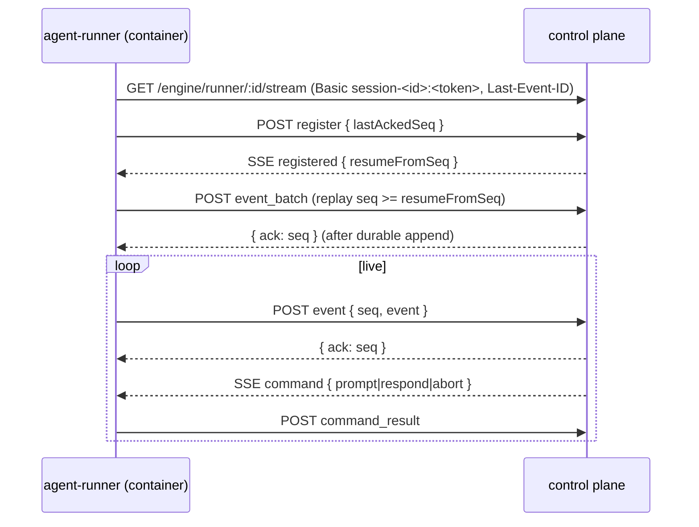

# Self-hosting sessions P1 — runtime seam

P1 of the [self-hosting sessions design](/product/designs/self-hosting-sessions-design.md)[^parent]:
build the **seam** that lets the container own pi's stdio, without changing any default.
It resolves the parent's three open decisions (transport, runner delivery, event-log
ownership) and records the deploy-model amendment and the invariant #4 clarification that
the implementation codifies in ADR 020. `PiRpcHarness` stays default; the runner is opt-in;
the public JSON/SSE surface and the `AgentHarness` port[^harness] are unchanged.

The seam is deliberately a *contract* — protocol, port, and delivery flag — so P2
(lifecycle/SSE reconcile), P3 (cutover) and P4 (cleanup) can land on it independently.

## Decisions

### D1 — Transport: the runner dials out; SSE downstream + JSON POST upstream

The runner opens all connections to the control plane: a long-lived **SSE** stream for
control→runner and **JSON POST** requests for runner→control. It is mounted on an
engine-internal path (`/engine/runner/…`), **not** under `/api` and **not** added to the
public route table[^adr-014]. Auth is the existing session credential
`session-<id>:<token>`, validated by the same constant-time comparison as every session
loopback request (the runner is a platform client, invariant #5).

Rationale: this is the platform's own client pattern (SSE downstream, POST upstream) and
reuses the substrate already hardened for it — `text/event-stream`, `X-Accel-Buffering:
no`, SSE heartbeat, nginx basic auth[^adr-014]. No new dependency, no new primitives, no
new identity, no new public surface.

- *Rejected — control plane dials in.* Needs the container's address, NAT/port plumbing,
  and a re-dial per control-plane process; it does not survive a control-plane restart,
  which is the whole point.
- *Rejected — WebSocket.* Adds a dependency and nginx upgrade plumbing for a capability
  the existing SSE + POST substrate already provides; the bidirectional control channel
  does not need multiplexed frames.
- *Rejected — long-poll.* Higher latency and more requests for the same ordering
  guarantee.

### D2 — Runner delivery: the container entrypoint, opt-in

When the runner runtime is selected, `createInteractiveContainer` sets
`Entrypoint: ["node", "/runner/agent-runner.mjs"]` and the runner spawns `pi --mode rpc`
itself. When it is not selected, the current
`Entrypoint: ["/bin/sleep"], Cmd: ["infinity"]` + `docker exec` path is byte-for-byte
unchanged[^docker]. The runner ships in the agent image (context is `/agent-image`, so it
is a self-contained Node program — no workspace imports).

The runtime is resolved at create time (invariant #2, create-time is resolution-time) from
server config (`SESSION_RUNTIME`, default `exec`) and recorded on the server-side session
record (`AgentSession.runtime`, stripped from the wire like `platformToken`), so
`recover()` re-selects the same harness deterministically. The runner requires the session
credential, so a runner session always gets `AGENT_LAND_URL` /
`AGENT_LAND_BASIC_AUTH` injected. **Exec stays the default; P1 changes no behaviour
unless `SESSION_RUNTIME=runner`.**

- *Rejected — sidecar container.* A second container adds a lifecycle, a shared
  namespace/volume, and a second image to keep in sync, while still shipping the runner in
  an image; it buys nothing invariant #4 doesn't already get from the clarification below.
- *Rejected — a `docker exec`-launched background runner.* The exec stream is exactly the
  control-plane-owned resource the seam removes; launching the runner through it
  re-introduces the failure.

### D3 — Event-log ownership: runner-owned spool + control-plane observation log

The **runner owns the sequence and the replay spool**: it assigns a monotonic `seq` per
`SessionEvent`, appends each to a durable capped spool on the session volume
(`/sessions/<id>.runner-spool.jsonl`), and trims up to the last acked seq. The **control
plane keeps the observation log**: it appends acked events to
`data/sessions/<id>.events.jsonl`[^event-log] **with the runner's seq**, then acks. On
reconnect the runner replays from the control plane's `resumeFromSeq`; the control plane
dedupes by seq.

Rationale: invariant #3 (the event stream is the platform's only observation channel)
and the existing `GET /events` / SSE read path stay exactly as they are, so P1's public
surface is unchanged; the runner holds the replay authority, so a control-plane restart
cannot lose an in-flight turn's events. The shared-volume "runner owns the durable log"
end-state arrives in P2, when SSE replay reads the spool and the projection is retired.

- *Rejected — runner-owned log read directly by the control plane.* Reading the session
  volume from the control plane crosses the Docker boundary and changes the substrate;
  deferred to P2.
- *Rejected — pure control-plane spool.* The runner would have to re-derive its replay
  position from control-plane state, which is the coupling the seam removes.

### Deploy-model amendment (for ADR 020)

Control plane and session runtime get **separate lifecycles**. A `packages/**` merge
restarts the control plane only; runner sessions' channel reconnects and pi keeps running.
An `agent-image/**` merge affects **new** sessions only — a running container holds its
image by id[^learning-lifecycle]; a new runner version reaches runtime through the
existing image-refresh path. P1 establishes the boundary; P2 stops draining sessions on
shutdown; P3 proves a mid-turn merge is uninterrupted.

### Invariant #4 clarification (for ADR 020)

Invariant #4 — "no technology baked into containers; the agent image is node + pi + git +
curl" — is clarified: the runner is **harness plumbing**, the in-container half of the
`AgentHarness` port, in the same category as `entrypoint.sh`, `tk`, `sops`, and the `pi`
runtime itself. It is platform-owned code, not vendored third-party technology and not
composition (no workflows, no provider catalogs, no vendor knowledge); the image stays
generic[^boundary].

## Runner protocol (v1)

JSON messages; `v` is the protocol version. Auth: HTTP Basic `session-<id>:<token>` on
every request — the SSE connect and every POST.

**Channel (engine-internal, not in `packages/contracts/src/routes.ts`)**

- `GET /engine/runner/:sessionId/stream` — control→runner, `text/event-stream`. `Last-Event-ID`
  is the highest contiguous acked seq; SSE `id:` is the seq where applicable; `: ping`
  comments are heartbeats.
- `POST /engine/runner/:sessionId/messages` — runner→control, one JSON envelope. The
  response `{ "ack": <seq> }` is the durable-ack watermark.

**Runner → control**

| Message | Payload |
|---|---|
| `register` | `{ v, type, sessionId, runnerVersion, protocolVersion, lastAckedSeq }` |
| `event` | `{ v, type, seq, event }` — one `SessionEvent`[^event-contract] |
| `event_batch` | `{ v, type, events: [{ seq, event }] }` |
| `heartbeat` | `{ v, type, lastSeq }` |
| `command_result` | `{ v, type, id, ok, error? }` |
| `error` | `{ v, type, code, message }` |

**Control → runner**

| Message | Payload |
|---|---|
| `registered` | `{ v, type, sessionId, resumeFromSeq, heartbeatIntervalMs }` |
| `command` | `{ v, type, id, name: "prompt" \| "respond" \| "abort", payload }` |
| `ack` | `{ v, type, seq }` — cumulative, optional (the POST response is canonical) |
| `error` | `{ v, type, code, message }` |

**Replay & ack contract.** The runner assigns `seq` (monotonic per session) and serializes
upstream sends, awaiting each `ack` before advancing. The control plane appends to the
observation log and acks only after the append. On connect the runner registers with
`lastAckedSeq`; the control plane replies `registered.resumeFromSeq` = last durably stored
seq + 1; the runner replays spool entries `seq >= resumeFromSeq`, then goes live. The
control plane ignores `seq <= ackedSeq`, so at-least-once delivery converges. The runner
trims its spool up to the acked seq. This is the contract the fake-transport test pins.



## Interfaces

**`AgentHarness` — unchanged.** `start(session) → AgentHandle { events, prompt, respond,
abort, stop }`[^harness] stays the only engine contract. `RemoteAgentHarness` is a second
implementation behind it:

```ts
// packages/server/src/infra/remote-agent-harness.ts
export class RemoteAgentHarness implements AgentHarness {
  constructor(private transport: RunnerTransport) {}
  async start(session: AgentSession): Promise<AgentHandle> { /* accept + wrap */ }
}
```

`prompt`/`respond`/`abort` send `command` frames; `events()` replays buffered
`SessionEvent`s to the first subscriber, exactly like `PiRpcHarness`[^pi-rpc-harness];
`stop()` closes the channel (it does **not** kill pi — the runner must outlive the control
plane). Container termination stays `kill()`'s `removeContainer`.

**New port, for testability.**

```ts
// packages/server/src/core/runner-transport.ts
export interface RunnerConnection {
  send(msg: RunnerMessage): Promise<void>;
  onMessage(handler: (msg: RunnerMessage) => void): () => void;
  onClose(handler: () => void): () => void;
  close(): Promise<void>;
}
export interface RunnerTransport {
  accept(session: AgentSession, opts: { lastAckedSeq: number; timeoutMs?: number }): Promise<RunnerConnection>;
  abandon(sessionId: string): void;
}
```

Production binding: `SsePostRunnerTransport` implements `RunnerTransport`, exposes the two
Express handlers that `server.ts` mounts at `/engine/runner` behind the existing auth
middleware, and resolves `accept()` when the matching `register` arrives. The
fake-transport integration test substitutes a `FakeRunnerTransport` with no HTTP.

**Harness selection.** `SessionService` keeps the injected `harness` (`PiRpcHarness`) as
the default and accepts an optional `runnerHarness`; `harnessFor(session)` returns the
runner harness only when `session.runtime === "runner"`, in both `createSession` and
`recover`. `agentContainerId()` is unchanged, so container lookup/recovery is untouched.

**Observation log.** `JsonSessionEventLog` gains a seq-aware append/read (a line becomes
`{ seq, event }`; legacy raw-event lines still read, indexed by position). This is what
lets SSE history and replay share the runner's seq after cap trimming. No public change.

## Runner in the agent image

`agent-image/runner/` — a self-contained Node ESM program (the image already has node 22;
build context is `/agent-image`, so no workspace imports):

- `agent-runner.mjs` — reads `AGENT_LAND_URL` / `AGENT_LAND_BASIC_AUTH`, spawns pi with the
  create-time argv passed as `AGENT_RUNNER_PI_ARGV` (JSON, derived from `piRpcPreset`),
  owns pi's stdin/stdout, maps pi-RPC → `SessionEvent`, drives the transport;
- `protocol.mjs`, `pi-rpc.mjs`, `spool.mjs`, `transport.mjs` — codec, mapping, spool,
  SSE/POST client;
- `*.test.mjs` — node:test units, added to the root `test` script.

The runner spawns pi at startup, before connecting, so a control-plane outage cannot
prevent a session from starting; events accumulate in the spool and replay on reconnect.
`agent-image/Dockerfile` adds `COPY runner/ /runner/`. The exec harness remains default.

## Risks & mitigations

| Risk | Mitigation |
|---|---|
| Backpressure / ack ordering | Serialized upstream POSTs awaited against the durable-ack response; cumulative ack + seq dedupe; pinned by the fake-transport test |
| Control-plane restart mid-stream | Runner reconnects, registers `lastAckedSeq`, replays from `resumeFromSeq`; observation log is the durable projection |
| Seq vs. observation log after `HISTORY_CAP` trim | Log lines carry the runner's seq; legacy lines read by index |
| CAP-dropped, `no-new-privileges` container | Runner is plain Node over outbound HTTP; no caps, no privileged ports; verified in the integration test |
| Two runners registering for one session | One live connection per session; latest register wins, prior connection is closed |
| Runner crash while pi is alive | **Out of scope for P1** (no interruption *guarantee* yet); `recover()` marks the session stopped on timeout. P2 reconciles |
| `stop()` semantics change for runner sessions | Documented: `stop()` detaches, `kill()` removes. Exec sessions are unchanged; lifecycle reconcile is P2 |
| `agent-image` staleness | Runner only reaches new sessions; the image-refresh path handles versioning |
| Public-surface drift | Channel lives outside `/api` and `routes.ts`; auth middleware reused; no new primitive or route contract |

## Minimal change set

**New** — `packages/server/src/core/runner-protocol.ts`,
`packages/server/src/core/runner-transport.ts`,
`packages/server/src/infra/sse-post-runner-transport.ts`,
`packages/server/src/infra/remote-agent-harness.ts`, the three server tests, and
`agent-image/runner/*`.

**Modified** — `core/types.ts` (`runtime`), `core/ports.ts` (`SessionEventLog` seq),
`core/session-service.ts` (harness selection, credential, seq-aware log),
`config.ts` (`SESSION_RUNTIME`), `infra/docker.ts` (entrypoint), `infra/repositories.ts`
(seq-aware log), `server.ts` (wire both harnesses + channel), `agent-image/Dockerfile`,
root `package.json` (runner tests), `designs/index.md` (this note).

**Docs on merge** — ADR 020 records D1–D3, the deploy-model amendment, and the invariant
#4 clarification; the parent design note gets a forward pointer from "Open decisions".

## ADR pointer

New `docs/knowledge/adrs/020-session-runtime-seam.md` — **proposed in the P1
implementation PR, accepted on its merge**. It records the three decisions, the separate
control-plane/session-runtime deploy model, and the invariant #4 clarification. This note
is its reviewable spec. No new primitive; the change lands on the declared
`AgentHarness` seam[^engine].

## Answers to the ticket's open questions

- **Transport** — runner dials out; SSE downstream + POST upstream on an engine-internal
  path (D1).
- **Runner delivery** — container entrypoint, opt-in via `SESSION_RUNTIME` (default
  `exec`), recorded per session for deterministic recovery (D2).
- **Event-log ownership** — runner-owned spool and sequence; control-plane observation log
  as the durable projection (D3).
- **Flag mechanism** — server config, not a public API field; exec stays default, so P1 is
  a no-op in production.
- **`stop()`** — detaches the channel; the runner outlives the control plane; `kill()`
  removes the container. Exec unchanged.

## Acceptance-criteria mapping

1. **ADR 020** — the implementer writes it from D1–D3 + the two amendments above.
2. **Protocol spec + unit tests** — the tables above are the spec; `runner-protocol.test.ts`
   and `agent-image/runner/*.test.mjs`.
3. **`RemoteAgentHarness` implements `AgentHarness`** — `harnessFor` selection; typecheck +
   tests green.
4. **Runner in the image behind a flag** — D2; `PiRpcHarness` remains default.
5. **Integration test** — `runner-seam.integration.test.ts` drives register → command →
   event → ack through `RemoteAgentHarness` with a fake transport, covering replay.

[^parent]: [Self-hosting sessions design](/product/designs/self-hosting-sessions-design.md) — merged #135, stable; P0 drain fix #136 already landed
[^engine]: [Agent Land engine](/platform/engine.md) — the `AgentHarness` port is the reference-runtime seam
[^boundary]: [Agent Land domain boundary](/product/goals/boundaries.md) — session execution is in-core; no orchestration, UI, or vendor knowledge added
[^harness]: `packages/server/src/core/harness.ts` — `AgentHarness` / `AgentHandle` / `piRpcPreset()`
[^pi-rpc-harness]: `packages/server/src/infra/pi-rpc-harness.ts` — `mapRpcEvent` and the replay-to-first-subscriber `EventStream`
[^docker]: `packages/server/src/infra/docker.ts` — `createInteractiveContainer()` entrypoint override
[^session-service]: `packages/server/src/core/session-service.ts` — `createSession`, `recover`, `drainAll`, `push`
[^event-contract]: `packages/contracts/src/event.ts` — the `SessionEvent` union the runner emits
[^event-log]: `packages/server/src/infra/repositories.ts` — `JsonSessionEventLog` under `data/sessions/<id>.events.jsonl`
[^adr-002]: [ADR 002 — Docker socket sibling containers](/adrs/002-docker-socket-sibling-containers.md)
[^adr-014]: [ADR 014 — JSON API canonical machine interface](/adrs/014-json-api-canonical-machine-interface.md) — SSE downstream + POST upstream is the existing client pattern
[^learning-pi]: [pi `--mode rpc` harness](/learnings/pi-rpc.md)
[^learning-lifecycle]: [Session lifecycle & redeploy resilience](/learnings/session-lifecycle.md) — container presence is ground truth; running containers hold their image by id
