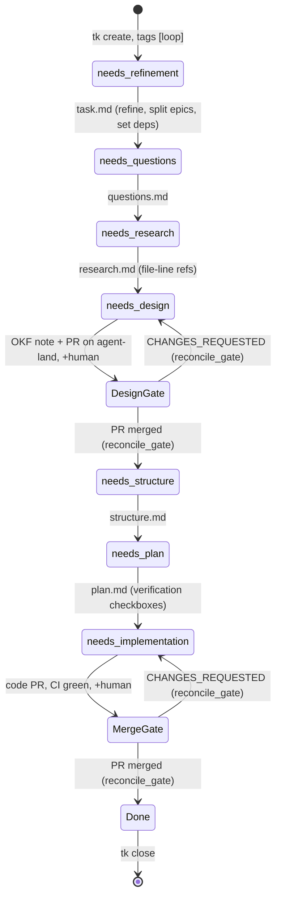
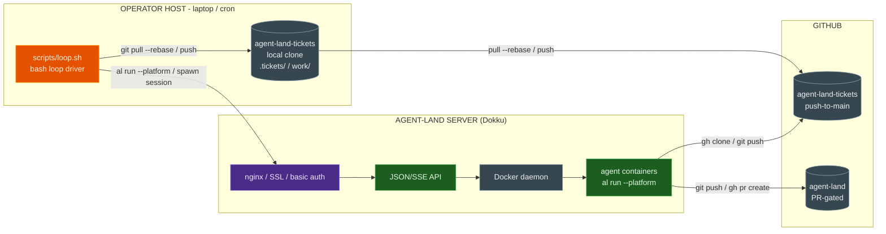

# Ticket layer — agent-land-tickets

Design for the [ticket layer feature](/product/features/ticket-layer.md): a second repo records work state, agent-land stays the gated home of OKF memory and code, and the [ticket loop](/playbook/ticket-loop.md) drives it — all playbook composition, no engine change in v1[^adr-019].

## Approach — two repos

| | agent-land-tickets | agent-land |
|---|---|---|
| Role | queue + ephemeral HITD workspace | durable product memory + code |
| Writes | push-to-main, no CI | protected main, PR-gated |

## Phase-label funnel

Labels are the HITD ladder as `tk` tags; one phase per tick, retag only after the phase's artifact is committed. Artifacts are the truth, the label a cheap index re-derived from them.



## Interfaces — layout and ticket schema

Layout: `.tickets/<id>.md` (ticket), `work/<id>/` (ladder artifacts `task.md`…`plan.md` + `thoughts.md`), `scripts/` (vendored pinned [tk](https://github.com/wedow/ticket), `loop.sh`), `AGENTS.md` (sync protocol, label ladder, loop rules).

```yaml
status: in_progress        # open | in_progress | closed
type: feature              # bug | feature | task | epic | chore
priority: 1                # 0 highest .. 4
assignee: <session git identity>   # the claim
tags: [loop, needs-design]         # phase label; + human when parked
deps: [al-5c40]
parent: al-5c00                    # epic
external-ref: gh-104               # agent-land PR — join key for reconciliation
```

`tk add-note` appends terse timestamped status to the ticket; `work/<id>/thoughts.md` is the append-only handoff log — each step agent reads it and appends `HITD_HANDOFF_V1` / `STATUS` entries before returning, so the next fresh agent needs no carried state (protocol per the HITD skill, cited in [ticket-loop](/playbook/ticket-loop.md#handoff-contract--the-hitd-port)).

## Loop v1 and sync protocol

`scripts/loop.sh` — one tick, one step; a curl-based bash driver on host cron first, engine-native scheduler later. No locks (why beads went to Dolt); git + small files + discipline give safety:

1. `git pull --rebase`; pick from `tk ready` (open, deps resolved) — highest priority, oldest first; none → stop. Phases may be skipped by retagging[^ticket-loop].
2. Precondition — still open and unclaimed? Claim via `tk start` (assignee = session identity) → commit → push. **Failed push invalidates the action**: re-pull, re-check, retry or back off; never force-push. Two claims on one small file surface as a rebase conflict — the concurrency detector.
3. Spawn a fresh agent with the phase's `HITD_HANDOFF_V1` prompt, bound to an agent-land checkout; it does exactly one phase, writes artifacts, appends thoughts, returns `STATUS`. `PROGRESS` leaves the label; the next tick resumes at `plan.md`'s first unchecked item.
4. Loop retags (or `+human` at a gate) → commit → `pull --rebase` → push. Stop; next tick, next step.

Where the pieces run — the loop driver is a client of the platform, never part of it:



The one line that matters is `loop → nginx`: `loop.sh` never runs inside agent-land — it calls the platform over the same public API as any other client. Only the spawned agents touch the repos, cloning `agent-land-tickets` to work a phase and opening PRs on `agent-land`.

## Gates

- **Design gate** — the agent writes the agent-land OKF Design note only (no tickets `design.md`), opens the PR, records `external-ref: gh-<n>`, parks at `[loop, human, needs-design]`. Merge = approval; `CHANGES_REQUESTED` sends it back.
- **Merge gate** — the implementation PR on agent-land; the loop never approves or merges[^ticket-loop].

Both gates are reconciled by `reconcile_gate`: each tick, before the `human` skip, reads the parked ticket's `external-ref` PR via `gh pr view --json state,reviewDecision` and acts — design `MERGED` advances to `needs-structure`, implementation `MERGED` closes the ticket, `CHANGES_REQUESTED` unparks back to the phase (see the [gate-reconciliation design](/product/designs/alt-sj6u-loop-gate-reconciliation-design.md)). The operator's only inputs are merge and change-request.

## Reconciliation

`reconcile_gate` runs each tick before the `human` skip: for a parked ticket with an `external-ref` PR, `gh pr view --json state,reviewDecision` decides advance / close / unpark / stay, keyed on the parked phase tag. A ticket is **done** only when closed *and* its `external-ref` PR is merged. The report step (loop tick, `tk-funnel` plugin, or cron) joins the product funnel (intake → designed → approved) against the engineering funnel (planned → implemented → merged): throughput, leakage (approved design unmerged after N days; stalled labels), per-label conversion.

## Engine phase (later)

- Bake `tk` + `jq` into `agent-image/Dockerfile`; mount agent-land-tickets into sessions (`TICKETS_DIR`); code workspaces stay per-session; lock-mount mutex + stale guard per the heartbeat design[^ticket-loop].
- Laptop cron → engine-native scheduler, as the loop's first self-built ticket. Read-only board as a web-ui consumer of `tk query` JSON (ADR 018).

## Operator model

- **Intake** — the [product-owner](/playbook/product-owner.md) agent turns outcomes into loop-ready tickets (split, deps, `loop` tag), instead of hand-run `tk create`.
- **Host loop** — `scripts/loop.sh` runs unattended as a host cron (managed by `personal-infra/server/05-ticket-loop.sh`), not on the laptop.
- **Gates** — design (PR on the OKF note) and merge (implementation PR); the loop parks at `[loop, human, <phase>]` and reconciles it each tick — merge and change-request are the only operator inputs.

## Answers to the Feature's open questions

1. **Design-gate home:** promote into agent-land OKF — ADR 017 keeps memory versioned with code, the PR *is* the review; the ticket-repo draft is the working copy.
2. **Loop driver:** laptop bash cron first; the engine-native scheduler becomes the loop's first self-built ticket.
3. **Thoughts:** both — `tk add-note` (terse), `thoughts.md` (full handoffs).
4. **Label vs artifact:** artifacts win; the label is re-derived each tick.
5. **Scope:** agent-land-only in v1; `external-ref` is the seam that grows into a cross-repo queue.

## Risks & mitigations

| Risk | Mitigation |
|---|---|
| Claim races (no lock) | one ticket per session; rebase-conflict detection; failed push invalidates; lock-mount in the engine phase |
| Two-repo drift (label ahead of reality) | reconciliation report; the design-gate PR is the single promotion point |
| `tk` upstream quiet (Mar 2026) | vendored + pinned, MIT, treated as our own |

## ADR pointers

New [ADR 019](/adrs/019-ticket-layer-git-synced-repo.md); consistent with [008](/adrs/008-json-files-no-database.md) (no database), under [017](/adrs/017-product-layer-okf-memory.md) (feeds OKF), future board per [018](/adrs/018-web-ui-separate-consumer.md).

## Minimal change set

**This PR (docs):** ADR 019, Feature + Design notes, index updates, cross-links in `ticket-loop.md` / `dogfooding.md`. **After the gate:** create agent-land-tickets, vendor `tk`, author its `AGENTS.md` + `loop.sh`, migrate open work into tickets, then the engine-phase items.

[^ticket-loop]: [Ticket loop](/playbook/ticket-loop.md) — decision rule, gates, concurrency, scheduler seam
[^adr-019]: [ADR 019 — ticket layer in a separate git-synced repo](/adrs/019-ticket-layer-git-synced-repo.md)
