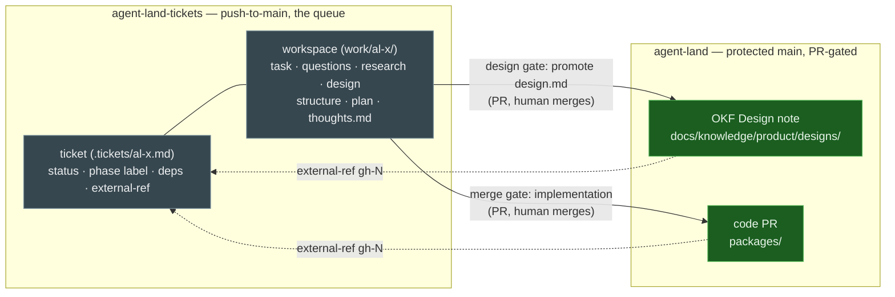
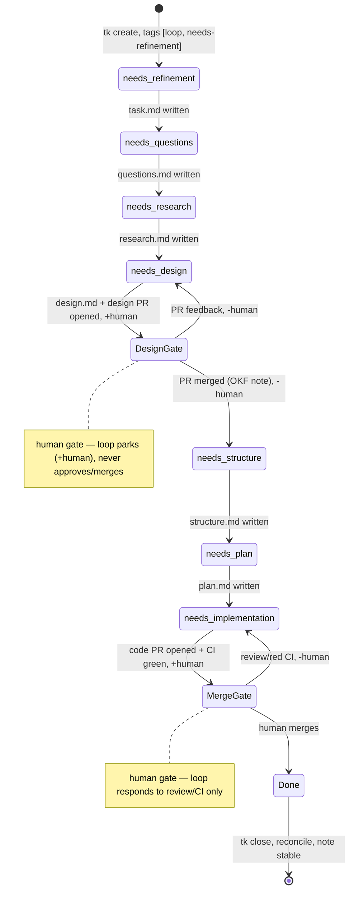
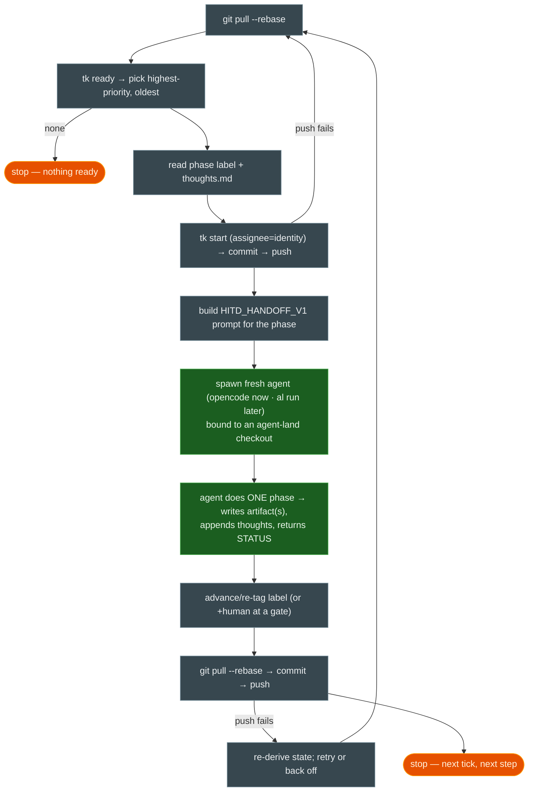

# Ticket layer — agent-land-tickets

The technical design for the [ticket layer feature](/product/features/ticket-layer.md): a second repo, **agent-land-tickets**, is the system of record for *work state*; `agent-land` stays the gated home of *durable product memory* (OKF) and *code*. The [ticket loop](/playbook/ticket-loop.md) is the driver; this note defines the state it drives. Everything here is **playbook-level composition** — no engine primitive changes in v1[^dogfooding][^adr-019].

## Approach

Two repos, two cadences, one join key:

| | agent-land-tickets | agent-land |
|---|---|---|
| Role | work queue + ephemeral HITD workspace | durable product memory + code |
| Contents | `.tickets/`, per-ticket artifacts + thoughts | OKF notes (`docs/knowledge/`), `packages/` |
| Write model | push-to-main, no protection, no CI | protected `main`, PR-gated |
| Cadence | fast, churny (every status change) | slow, reviewed (every change a PR) |
| Statefulness | the truth about *status* | the truth about *content* |

A ticket flows left-to-right through a **phase-label funnel**; each phase produces a durable **artifact** in the ticket's workspace. The label is the cheap index the loop reads to pick a step; the artifacts are the authoritative state the label is re-derived from. At two points the funnel touches `agent-land` through a human gate: the **design gate** (promote `design.md` into the OKF bundle as a Design-note PR) and the **merge gate** (the implementation PR on the code). The ticket's `external-ref` records the `agent-land` PR number — the join key for reconciliation.



## The phase-label funnel

The funnel is the [HITD ladder](/playbook/ticket-loop.md#state-model--the-artifact-ladder) expressed as `tk` tags, so a bash loop can select the next step by label without parsing prose[^hitd]. One phase per tick; the loop advances the label only after the phase's artifact is committed.



| Phase label | Step the loop spawns | Artifact produced | Next label |
|---|---|---|---|
| `needs-refinement` | refine raw outcome; split epics; set deps | `task.md` | `needs-questions` |
| `needs-questions` | neutral questions about the current system | `questions.md` | `needs-research` |
| `needs-research` | factual findings with `file:line` refs | `research.md` | `needs-design` |
| `needs-design` | the design for approval | `design.md` → **design PR** on agent-land | `human` (parked) |
| `needs-structure` | implementation slices + checkpoints | `structure.md` | `needs-plan` |
| `needs-plan` | tactical steps + verification checkboxes | `plan.md` | `needs-implementation` |
| `needs-implementation` | implement, verify, open PR | code → **merge PR** on agent-land | `human` (parked) |
| `human` | parked at a gate — loop skips | — | gate clears → resume |

`tk ready` (open/in-progress, deps resolved) is the candidate set; the loop picks highest priority, oldest first, exactly as the heartbeat's decision rule[^ticket-loop]. A ticket may skip phases (e.g. a docs-only change skips `needs-research`) by retagging — the ladder is the default, not a straitjacket.

## Repo layout (agent-land-tickets)

```
agent-land-tickets/
  .tickets/                 # tk tickets: <id>.md, markdown + YAML frontmatter
    al-5c46.md
  work/                     # per-ticket HITD workspace (artifacts + thoughts)
    al-5c46/
      task.md  questions.md  research.md
      design.md  structure.md  plan.md
      thoughts.md           # append-only HITD handoff log
  scripts/
    tk                      # vendored, pinned (upstream quiet since Mar 2026)
    loop.sh                 # the bash driver (v1)
  AGENTS.md                 # sync protocol + loop rules + label ladder
  README.md
```

`tk` searches parent dirs for `.tickets/` (override `TICKETS_DIR`); the loop exports `TICKETS_DIR=$REPO/.tickets`. Tickets are small single files so a rebase conflict on a concurrent claim is the concurrency detector (see Sync protocol).

## Ticket schema (tk frontmatter)

`tk` already carries everything the funnel needs; we add phase labels as tags:

```yaml
---
id: al-5c46
title: Add the ticket layer
status: in_progress          # tk: open | in_progress | closed
type: feature                # tk: bug | feature | task | epic | chore
priority: 1                  # tk: 0 (highest) .. 4
assignee: <session git identity>   # tk default = git user.name; the claim
tags: [loop, needs-design]   # phase label + loop opt-in (+ human when parked)
deps: [al-5c40]              # tk dependency graph
parent: al-5c00              # epic, if any
external-ref: gh-104         # the agent-land PR/issue this maps to (join key)
---
Short body: the outcome in a paragraph + acceptance criteria.
```

Rules: the ticket holds **status and pointers**; reasoning lives in `work/<id>/` artifacts and, when approved, in `agent-land` OKF notes. `tk add-note <id>` appends terse timestamped status to the ticket; `work/<id>/thoughts.md` holds the full `HITD_HANDOFF_V1` / `STATUS` handoff entries[^hitd].

## Thoughts — the HITD handoff log

Each step agent reads `work/<id>/thoughts.md` for context and appends its handoff before returning, so the *next* fresh agent needs no carried state:

```text
HITD_HANDOFF_V1
phase: design
work_directory: work/al-5c46
expected_inputs: [task.md, questions.md, research.md]
expected_outputs: [design.md]
instructions: draft the design; open the design PR on agent-land; park with +human
```
```text
STATUS: COMPLETED
ARTIFACTS: [work/al-5c46/design.md]
SUMMARY: drafted design; opened agent-land PR gh-104; set external-ref; tagged human
```

This is the HITD protocol verbatim — the loop is the orchestrator, the step agent is the phase child[^hitd][^ticket-loop].

## Loop v1 — the bash driver

`scripts/loop.sh`, one tick = one step. Laptop-side (opencode) first; engine-side later.



Exactly one child per tick — throughput comes from tick frequency, not in-tick parallelism (v1)[^ticket-loop]. A `PROGRESS` status (the agent ran out of window) leaves the label unchanged; the next tick's fresh agent resumes from `plan.md`'s first unchecked item.

## Sync protocol — optimistic concurrency, no locks

`tk` has no lock (this is why beads moved to Dolt); we get safety from git + small files + discipline:

1. `git pull --rebase` **before** any read or action.
2. **Precondition** — ticket still `open`/unclaimed? (`tk show`). If another identity claimed it, back off.
3. **Claim with identity** — `tk start <id>` sets `assignee` to the session git identity (`GIT_USER_NAME`/`GIT_USER_EMAIL` injected per the [git-identity design](/product/designs/git-identity-design.md)) → commit → push.
4. **Failed push invalidates the action** — re-pull, re-check the precondition, retry or abandon. Never force-push.
5. **Conflict = detector** — two claims on one ticket touch one small file → rebase conflict → the agent must resolve (usually: the other identity won the claim, so back off), never a silent overwrite.

The engine phase reuses the heartbeat's mutex: bind a dedicated lock mount (`ticket-loop`) — the server enforces at most one live session per mount, so an overlapping tick fails to create and skips; a stale guard clears a crashed run[^ticket-loop].

## Gates

Both gates stay human, per the trust ladder ("merge rights are earned")[^dogfooding]:

- **Design gate.** At `needs-design` the agent drafts `work/<id>/design.md`, then opens a PR on **agent-land** promoting it to `docs/knowledge/product/designs/<slug>-design.md` (an OKF Design note). The loop tags the ticket `human` and parks. Merge = approval; the OKF note goes `draft → stable` on merge (per ADR 017 / the [okf skill](/playbook/dogfooding.md)). Feedback on the PR → `-human`, retag `needs-design`, the loop revises.
- **Merge gate.** At `needs-implementation` the agent opens the code PR on **agent-land**, tags `human`, parks. The loop may respond to review comments and fix red CI, but never approves, never merges.

The loop's relation to a gate is always: *advance up to the gate, park, report, move to another ticket* — it never waits; waiting is the next tick's job[^ticket-loop].

## Reconciliation — product funnel in, engineering funnel out

The operator's two funnels join on `external-ref`:

- **Product funnel (in):** intake → refined → designed → approved. The left labels; "approved" = design PR merged (OKF Design note `stable`).
- **Engineering funnel (out):** planned → implemented → merged. The right labels; "merged" = implementation PR merged.
- **Join key:** `external-ref` (gh-PR) + ticket id links a ticket to the agent-land PRs it produced.

A report step (a loop tick, a `tk-funnel` plugin, or a cron) emits:

- **Throughput** — tickets whose implementation PR is merged (cross-checked against `external-ref` on GitHub).
- **WIP / leakage** — approved design but no merged PR after N days; tickets stuck on a label.
- **Funnel conversion** — count per phase label; where work pools.

This answers *"was jetzt wirklich was implementiert hat"*: a ticket is only **done** when its label is closed **and** its `external-ref` PR is merged — design approved but not landed shows up as leakage, not as progress.

## Engine phase (later, no v1 dependency)

- Bake `tk` + `jq` into `agent-image/Dockerfile` so engine sessions get `tk` on PATH.
- Mount agent-land-tickets into sessions (`TICKETS_DIR` set); the code workspace stays the per-session branch — coordination state shared, code state isolated. This maps cleanly onto the Mount + Platform Connector primitives.
- Replace laptop cron with the [engine-native scheduler](/playbook/ticket-loop.md#generalization-seam-deliberately-thin) — a fitting *first ticket for the loop to build itself*.
- A web-ui consumer (ADR 018) may render a read-only board + the draft design from `tk query` JSON — presentation, never in-core[^adr-018].

## Answers to the Feature note's open questions

1. **Design-gate home.** Default: **promote into agent-land OKF** (keeps ADR 017's "memory versioned with code"; the PR *is* the review). The `work/<id>/design.md` draft is the working copy; the ticket-repo-only variant (plus a web-ui render) stays a future option, not v1[^adr-017].
2. **Loop driver.** **Laptop bash cron first** (proves the recipe, zero engine dependency); the engine-native scheduler becomes the loop's first self-built ticket once the bash loop has run in anger[^ticket-loop].
3. **Thoughts mechanism.** **Both** — `tk add-note` for terse status on the ticket; `work/<id>/thoughts.md` for the full `HITD_HANDOFF_V1`/`STATUS` handoff.
4. **Label vs artifact authority.** **Artifacts win.** The label is a cheap index the loop maintains and re-derives from committed artifacts each tick; on disagreement the artifact is the truth (state is derived, never "what the last tick intended")[^ticket-loop].
5. **Scope.** v1 is **agent-land-specific**. Generalizing to a cross-repo queue (tickets carrying `repo` + `branch`) is deferred until the platform orchestrates work across repos — the `external-ref` field is the seam that grows into it.

## Interfaces

- **agent-land-tickets repo** — `.tickets/<id>.md` (tk frontmatter above), `work/<id>/` (artifact ladder + `thoughts.md`), `scripts/tk` (vendored, pinned), `scripts/loop.sh` (the driver), `AGENTS.md` (sync protocol + label ladder + loop rules).
- **`tk` surface used** — `tk create/start/close`, `tk dep`/`tk ready`/`tk blocked`, `tk ls -T <label>`, `tk add-note`, `tk query` (JSON for the future board). Plugins via `tk-<cmd>` on PATH (`tk-okf` crosslink lint, `tk-land` to spawn `al run`, `tk-funnel` report).
- **Handoff contract** — `HITD_HANDOFF_V1` prompt + `STATUS` reply, reused verbatim from the HITD skill[^hitd].
- **Gates** — agent-land PRs (design-note PR, code PR) via `gh`; `external-ref` records the number.
- **Engine phase** — `agent-image/Dockerfile` (`tk`, `jq`), a Mount for agent-land-tickets, `TICKETS_DIR`.

## Risks & mitigations

- **Claim races (no lock).** One ticket per session + rebase-conflict detection + failed-push-invalidates-action. Acceptable for a single operator; the engine phase adds the lock-mount mutex[^ticket-loop].
- **Two-repo drift** (ticket says `needs-structure`, design PR never merged). The reconciliation report surfaces leakage; `external-ref` discipline + the design gate (promotion PR) is the enforcement.
- **`tk` upstream quiet** (last push Mar 2026). Vendored + pinned, MIT — treat as our own; the bash script + `behave` tests come with it.
- **Label churn = many small commits.** That is the audit log, not noise; it lives in the push-to-main ticket repo, never in agent-land code PRs.
- **Design promotion is a copy step** (ticket draft → OKF note) that could diverge. The gate PR is the single promotion point; the OKF note is canonical once merged, the ticket draft is then frozen.
- **Scope creep into the engine.** Every piece is composition (git, tk, bash, mounts, existing API); nothing asks the server to understand tickets or workflows[^dogfooding].

## ADR pointers

- **New — [ADR 019](/adrs/019-ticket-layer-git-synced-repo.md):** the ticket layer lives in a separate git-synced repo with git as the sync layer.
- **[ADR 008](/adrs/008-json-files-no-database.md):** no database — tickets are plain markdown, consistent (this is why beads' Dolt/SQLite were rejected).
- **[ADR 017](/adrs/017-product-layer-okf-memory.md):** the ticket layer sits *under* the OKF product layer and feeds it; the design gate promotes drafts into OKF.
- **[ADR 018](/adrs/018-web-ui-separate-consumer.md):** a future read-only board is a separate web-ui consumer of `tk query` JSON, never in-core.
- **[ADR 016](/adrs/016-strip-web-ui-and-vendor-knowledge.md):** the loop, labels, and reconciliation are playbook composition outside the engine.

## Minimal change set

**This PR (docs only — the design gate):**

- New: `docs/knowledge/adrs/019-ticket-layer-git-synced-repo.md`, `docs/knowledge/product/features/ticket-layer.md`, `docs/knowledge/product/designs/ticket-layer-design.md`.
- Updated: `adrs/index.md`, `product/features/index.md`, `product/designs/index.md`.
- Cross-links: `playbook/ticket-loop.md` (backend seam now has a design), `playbook/dogfooding.md` (inventory + HITD-port rows).

**Implementation (after this gate merges, via the normal dev loop):**

- Create `agent-land-tickets` (private); vendor `tk` (pinned) into `scripts/`.
- Author `AGENTS.md` (sync protocol + label ladder + loop rules) and `scripts/loop.sh`.
- Define the phase-label set + `tk` tag conventions; migrate the current open work into tickets.
- Engine phase: `agent-image/Dockerfile` (`tk`, `jq`), a Mount for agent-land-tickets, scheduler ticket.

[^feature]: [Ticket layer Feature note](/product/features/ticket-layer.md)
[^ticket-loop]: [Ticket loop — the dogfooding heartbeat](/playbook/ticket-loop.md) — decision rule, gates, concurrency, generalization seam
[^pipeline]: [The product pipeline](/product/pipeline.md)
[^dogfooding]: [Dogfooding — the agent-land playbook](/playbook/dogfooding.md) — engine/playbook split, trust ladder, operator model
[^hitd]: HITD workflow skill — operator opencode config (`skills/hitd-workflow/SKILL.md`): artifact ladder, `HITD_HANDOFF_V1`, STATUS protocol
[^tk]: [wedow/ticket (tk)](https://github.com/wedow/ticket) — git-native ticket tracking, markdown + YAML frontmatter, dependency graph
[^adr-008]: [ADR 008 — flat JSON, no database](/adrs/008-json-files-no-database.md)
[^adr-017]: [ADR 017 — product layer on OKF memory](/adrs/017-product-layer-okf-memory.md)
[^adr-018]: [ADR 018 — web UI as a separate consumer](/adrs/018-web-ui-separate-consumer.md)
[^adr-019]: [ADR 019 — ticket layer in a separate git-synced repo](/adrs/019-ticket-layer-git-synced-repo.md)
