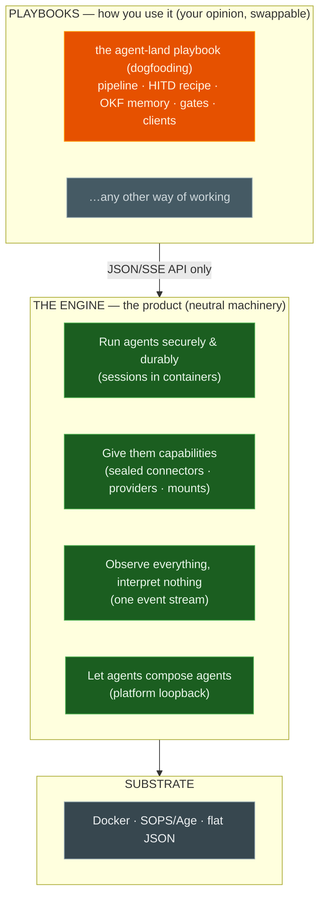

# Agent Land product vision

**One-liner:** Agent Land runs AI agents on your own server — securely, durably, unattended. **The engine runs agents; playbooks decide how.**

## Why it exists

Personal, local-first agent tools are powerful but live in a laptop terminal — a long task dies with the tmux session, a multi-hour run means keeping a pane awake, and a train ride with no signal means babysitting nothing. Rented cloud agents flip the problem: they keep running, but they aren't yours — their hardware, their queues, their rules. Agent Land keeps the spirit — mine, controlled, private — and moves the work onto your server:

- agents keep working after you close the laptop,
- you look in from anywhere, on any connection — the live feed replays what you missed,
- secrets stay encrypted until the moment an agent needs them,
- and the things you do repeatedly become recipes that eventually run on their own.

## The two layers

**The engine is the product. Everything above it is your opinion.**

The engine is neutral machinery. It runs agents securely in containers, gives each one sealed credentials, a model, and a workspace, observes everything through a single event feed, and lets agents hire agents. It knows nothing of your workflows — the technical decomposition (six primitives, three substrates) lives in the [engine note](/engine.md)[^engine].

How you use it lives in **playbooks** — bundles of skills, recipes, policies, and gates that realize one way of working. Playbooks are composition: they speak the same JSON/SSE API as every other client, and they are swappable — the engine never grows workflow knowledge[^strip-adr]. The first playbook is agent-land's own: the [dogfooding playbook](/dogfooding.md), where you state a problem, review PRs at gates, and everything in between runs itself.

## Value

1. **Durability** — sessions outlive the laptop; start Friday, look Monday.
2. **Control & privacy** — your infrastructure, your keys; agents get scoped, sealed credentials.
3. **Autonomy with trust** — agents run unattended but stop and ask when it matters, instead of guessing.
4. **Your way of working, encoded** — playbooks turn habits into skills, recipes, and gates.
5. **API-first** — everything the CLI does is a `curl` away; humans, crons, and agents are peer clients[^strip-adr].

## Principles

- **Mine.** Self-hosted; the only external dependency is the LLM provider.
- **Secrets stay sealed.** Encrypted at rest; decrypted in-memory, only at launch, only for what a session needs.
- **The engine runs agents; playbooks decide how.** Workflows, orchestration, and vendor knowledge stay outside the engine[^strip-adr].
- **Ask when it matters.** Human-in-the-loop is a designed state, not an interruption.
- **API-first.** No vendor catalog, no web UI in-core — presentation and preset knowledge live in clients and playbooks[^strip-adr].

[^strip-adr]: [Strip Web UI and Vendor Knowledge from Server](/adrs/016-strip-web-ui-and-vendor-knowledge.md)
[^engine]: [Agent Land engine](/engine.md)
