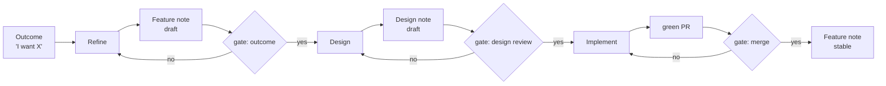

# The product pipeline

The pipeline's job is to raise the human's interaction level: state an **outcome**, review at **gates**, and let the pipeline produce the memory notes, the design, the plan, and the code in between. It is a recipe outside the engine — control flow belongs to the recipe, not to the engine[^archon].

## Stages

1. **Refine** — turn the outcome into a `Feature` OKF note: user stories, acceptance criteria, open questions. Deterministic where possible; AI only at the decision points[^archon].
2. **Design** — draft a `Design` OKF note: interfaces, risks, ADR pointers, and the minimal change set. Stops at the gate.
3. **Implement** — from an approved design, the build agent runs the standard dev loop (branch → typecheck → test → PR → CI green). Deterministic steps (`pnpm typecheck`, `pnpm test`) run as commands between AI turns[^archon].
4. **Close** — on merge, promote the `Feature` note `draft → stable` and capture learnings in `docs/knowledge/learnings/`.

## The three human gates

| Gate | Artifact | Mechanism |
|---|---|---|
| Outcome | Feature note (draft) | quick review of the note — did it capture intent? |
| Design | Design note (draft) | **PR on the note** — review like code; merge = approved design |
| Merge | green PR | existing PR review; merge stays human-gated |

## Who does what

- **`product` skill (opencode)** — stages 1 and 2, and the gate discipline. Runs today, no engine dependency.
- **build agent (opencode or `al run`)** — stage 3, the existing dev loop from `AGENTS.md`.
- **human** — the three gates. Nothing else.

## The future: agent-land-native

The same recipe ports to agent-land sessions once [Platform Connector](/knowledge/product/features/platform-connector.md) and [Mount](/knowledge/product/features/mount.md) land — an orchestrator session runs the pipeline on the platform and spawns the build session as a child. The human gates become `waiting_for_input` states. Until then, opencode skills exercise the same flow and teach us what the recipe needs.

[^archon]: [Inspiration from Archon](/knowledge/learnings/archon-inspiration.md) — recipe outside the engine, deterministic steps between AI nodes
