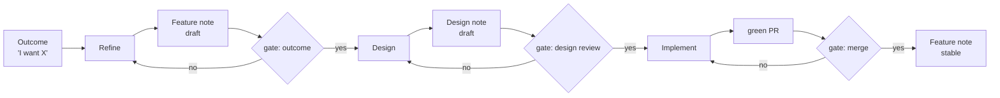

# The product pipeline

The pipeline's job is to raise the human's interaction level: state an **outcome**, review at **gates**, and let the pipeline produce the memory notes, the design, the plan, and the code in between. It is a recipe outside the engine — control flow belongs to the recipe, not to the engine[^archon].

## Stages

1. **Refine** — turn the outcome into a `Feature` OKF note: user stories, acceptance criteria, open questions. Deterministic where possible; AI only at the decision points[^archon].
2. **Design** — draft a `Design` OKF note: interfaces, risks, ADR pointers, and the minimal change set. Stops at the gate.
3. **Implement** — from an approved design, the build agent runs the standard dev loop (branch → typecheck → test → PR → CI green). Deterministic steps (`pnpm typecheck`, `pnpm test`) run as commands between AI turns[^archon].
4. **Close** — on merge, promote the `Feature` note `draft → stable` and capture learnings in `docs/knowledge/learnings/`.

## The human gates

| Gate | Artifact | Mechanism |
|---|---|---|
| Plan (Gate 0) | `plan.json` posted to the issue | human approves or amends the stage graph before any child spawns |
| Outcome | Feature note (draft) | quick review of the note — did it capture intent? |
| Design | Design note (draft) | **PR on the note** — review like code; merge = approved design |
| Merge | green PR | existing PR review; merge stays human-gated |

Gate 0 is additive: it precedes the other gates and does not replace them. A dynamic planner may reorder or reshape stages, but may never remove, merge, or bypass a gate.

## Who does what

Two implementations run this pipeline; the stages and gates are identical:

- **agent-land-native (canonical)** — an orchestrator session plans the stage graph per task ([dynamic orchestration](/product/features/dynamic-orchestration.md)) and spawns research / refine / design / implement children through the loopback API; gates are `waiting_for_input` parks. This is the [built system](/multi-agent-architecture.md).
- **laptop-side (opencode skills)** — the `product` skill runs stages 1–2 with the same gate discipline; a build agent (opencode or `al run`, following the [dev playbook](/dogfooding.md)) runs stage 3. No engine dependency; works offline and teaches the recipe.
- **human** — intake plus the gates (plan, outcome, design, merge). Nothing else. The two touchpoints of the [operator model](/dogfooding.md#the-operator-model--two-touchpoints).

## Agent-land-native — landed

The recipe no longer waits on the engine: [Platform Connector](/product/features/platform-connector.md) and [Mount](/product/features/mount.md) have landed, an orchestrator session runs the pipeline on the platform, and the human gates are `waiting_for_input` states re-prompted with the gate outcome. The opencode skills remain the laptop-side variant of the same flow.

[^archon]: [Inspiration from Archon](/learnings/archon-inspiration.md) — recipe outside the engine, deterministic steps between AI nodes
