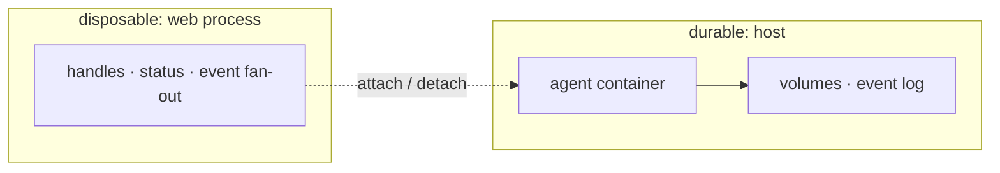
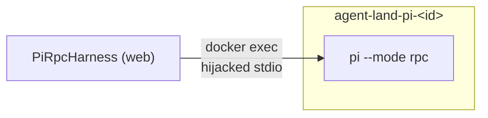
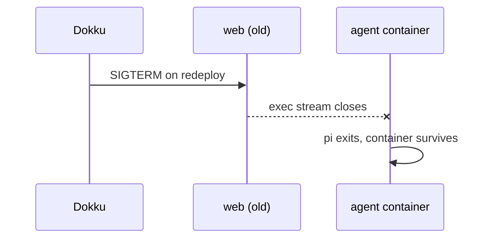
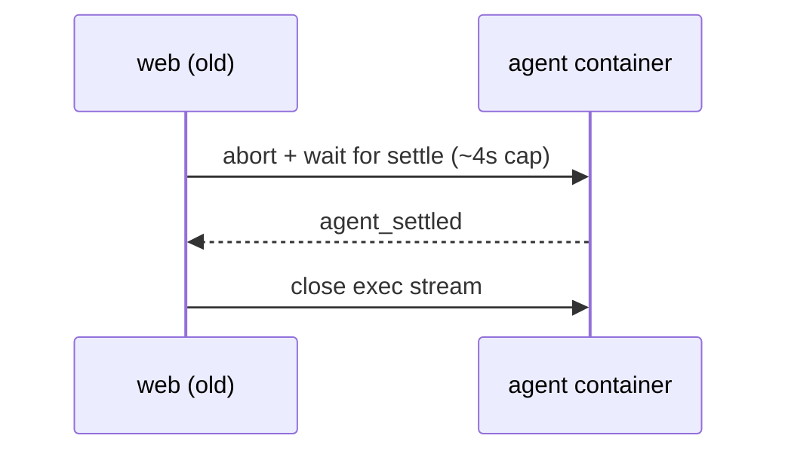
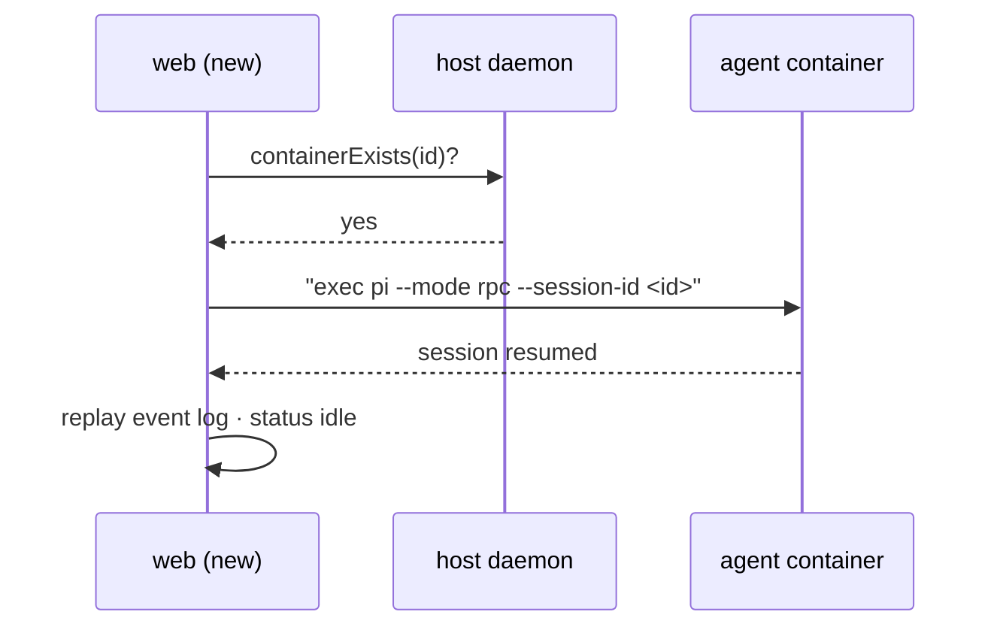

# Session Resilience Across Redeploys — Design

What happens when the orchestrator (the Dokku web container) is redeployed while agent sessions are still running, and how sessions recover their state.

## Architecture overview

The platform's working rule: **the host owns the session; the web process only attaches to it.** Everything that must survive a redeploy lives in Docker objects and files outside the web container; everything inside the web process is a disposable view that can be rebuilt.

The one thing that *cannot* survive a redeploy is the exec stream between the harness and pi — it is owned by the dying web process:

Everything the design adds works around that single fact: save what pi knows (its own jsonl), persist what the web knows (the event log), stop pi cleanly, and re-establish the stream on the other side.

## The question, answered

- **Is the agent's Docker container killed on redeploy?** No. Agent containers are *sibling* containers created directly on the host Docker daemon through the mounted socket (`adrs/002`). Dokku only manages the app's own `agent-land.web.1` container. On deploy, the old web container receives SIGTERM after the new one is up — observed on the server as `agent-land.web.1.1786886446` `Exited (143)`. Agent containers (`agent-land-pi-<id>`, entrypoint `sleep infinity`) are never touched.
- **Does the agent keep working?** No. The `pi --mode rpc` process lives inside the agent container but its stdin/stdout is a hijacked `docker exec` stream owned by the old web process (`PiRpcHarness.start`). When the web process dies, the socket closes, the exec stream gets EOF, and pi exits. Verified empirically: a leftover smoke-test container was still `running` with only `/bin/sleep infinity` — the pi exec was gone.
- **Can we "save" state?** Yes — most state is *already* saved. What is lost is the live harness handle, the in-memory event history, and the SSE subscriptions. Because `SessionService.handles` is in-memory only, the new web process cannot prompt pre-redeploy sessions today (`SessionNotFoundError`: "Session is not running").

## What happens today

After redeploy, the state is inconsistent:

- The agent container runs, the pi conversation (`/sessions/<id>/*.jsonl`), the workspace volume, and the JSON session record all survive.
- The session record's `status` is stale (e.g. `running` or `waiting_for_input` forever — nothing updates it anymore).
- `GET /api/sessions` lists the session; `POST /:id/prompt` answers 404 "not running"; SSE reconnects with empty history.

## Persistence matrix

| Layer | Survives redeploy? | Why |
|-------|--------------------|-----|
| Agent container (`agent-land-pi-<id>`) | Yes | Sibling on host daemon; Dokku never manages it |
| pi RPC process | No (exits) | Its stdio is an exec stream owned by the dying web process |
| pi session transcript (`/sessions/<id>/*.jsonl`) | Yes | Shared named volume `agent-land-sessions` |
| Workspace (`agent-land-ws-<id>` at `/workspace`) | Yes | Per-session named volume, kept on `kill()` by design |
| `AgentSession` JSON record (`data/sessions/<id>.json`) | Yes | Dokku storage mount `/app/data` |
| Harness handle (prompt/respond/abort) | No | `SessionService.handles` is in-memory |
| Event history (SSE transcript) | No (until the event log) | In-memory ring buffer (`HISTORY_CAP`) |
| Status accuracy | No | Stale; nothing emits events anymore |

## How it works

Three mechanisms cooperate across a deploy. The guarantee: **stop and continue where you left off** — the in-flight turn is cut gracefully, everything else (files, workspace, conversation, pending state) survives.

### 1. Durable event log (always on)

Every event the agent emits (status, message deltas, tool calls…) is appended to `data/sessions/<id>.events.jsonl`, capped to `HISTORY_CAP`, appends serialized per session id so concurrent events can't interleave or be dropped by the trim rewrite. The transcript exists on disk independent of the web process, and is replayed on boot and on SSE reconnect.

### 2. Drain on SIGTERM (deploy starts)

For every live session:

1. Send `abort` to the harness and wait for the agent to settle (bounded, ~4s cap) — pi stops its current work and persists its session file to the `/sessions` volume.
2. Close the exec streams. A `draining` flag makes `SessionService` ignore the resulting close→`stopped` events, so they neither update the persisted session record nor pollute the history.
3. Exit — well inside Dokku's 30s grace. The agent **container keeps running** on the host; it was never touched.

### 3. Re-attach on boot (new web process starts)

`recover()` runs at startup. For each persisted session:

- **Container `agent-land-pi-<id>` exists** → re-attach: run the identical harness preset — `docker exec pi --mode rpc --session-dir /sessions/<id> --session-id <id>`. Pi finds its saved session and resumes the same conversation (`--session-id`: "Use exact project session ID, creating it if missing"). The event log is replayed into the in-memory history, status is set to `idle`, and a stale `waitingFor` is cleared (if a request is genuinely pending, pi re-emits it; otherwise the user re-prompts).
- **Container missing** → the session is genuinely dead (container pruned, host cleaned, or `kill()` ran): mark it `stopped` with a synthetic status event.

Container presence is the single re-attach criterion — deliberately *not* the persisted status, because any status written before the process died is a guess, while the container is ground truth.

## Status handling

No new status value: the existing states cover recovery.

- Boot recovery with live container → `idle` (agent is settled; a new prompt drives it to `running`).
- Orphaned container → `stopped`.
- While draining, close events are ignored — the persisted status stays whatever it was before the drain, and the re-attach on the other side replaces it with the truth.
- The synthetic `status` event on re-attach is enough for the UI to re-render the session card; a follow-up UI nicety is a small "reconnected after redeploy" badge (out of scope here).

## Smoke-test plan

The design is grounded in observed behavior, but two claims must be verified against the real harness before implementation ships:

| # | Claim | Test | Result |
|---|-------|------|--------|
| 1 | `pi --mode rpc --session-id <id> --session-dir /sessions/<id>` on an existing session resumes it (same session id in events, prior conversation visible), not a new/forked session | Create session, prompt, kill only the web process (not the container), re-exec the same argv, assert resume | PASS (2026-08-17, isolated container: codeword remembered across exec death, single session file) |
| 2 | On orchestrator death, the pi exec exits (EOF) and the container survives | Already observed on a leftover smoke container; re-verify after drain is implemented | PASS (observed both before and after drain) |
| 3 | SIGTERM drain finishes within Dokku's 30s grace | Deploy while a session runs a long tool call; assert pi exited gracefully (jsonl complete) before SIGKILL | PASS (2026-08-17, local e2e: mid-turn SIGTERM → drained → restart → re-attached → codeword remembered) |

## Explicitly out of scope

- Moving the harness out of the web process (per-session daemons, tmux-style supervisors) so agents survive *independent* of the orchestrator — a bigger architectural change; recovery via re-attach reaches the same user-visible outcome.
- Zero-cut deploys: an in-flight turn is interrupted gracefully by design; it is not completed across the deploy.
- Checkpointing of in-flight tool executions — pi's own per-turn persistence is the checkpoint.
- Full transcript fidelity across redeploys — the event log is best-effort; pi's session file is authoritative.
- Auto-pruning of orphaned containers/volumes — surfaced as `stopped`, cleanup stays manual.
