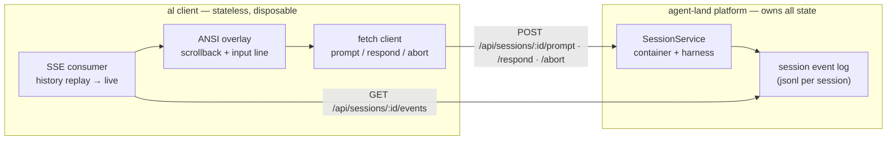
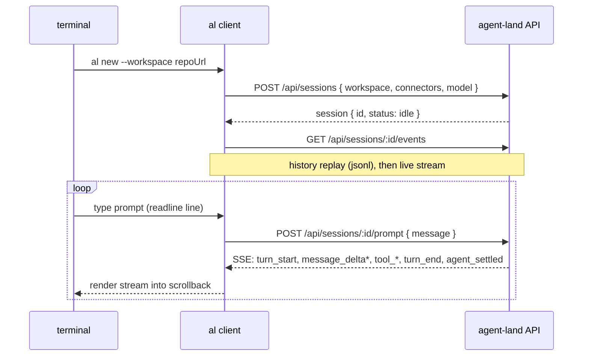

# Terminal Chat Client (`al`) — Design

A thin terminal client for agent-land: a chat overlay like pi coding agent's TUI, but where every action executes on the platform. The client is a pure projector and controller — no agent logic, no model calls, no state.

The web UI already covers the browser case. `al` covers the terminal: re-attachable from any machine (including over ssh), scriptable, and — being a daily-driver of the platform API — the first real dogfood of the public surface.

## Core model

One invariant: **the session is the single source of truth**. The server keeps the full event log (jsonl per session) and streams history replay + live events over SSE. A client is therefore completely stateless and disposable: connect, render, send input, quit. Nothing persists locally; tmux is optional and only keeps the *terminal window* alive, never session state.



Because replay and live events come over the *same* stream, attach is one connection: `GET /events` first replays the full history, then continues live. The server subscribes before replaying and dedupes via per-session sequence numbers, so the handoff is gapless. The stream carries `X-Accel-Buffering: no` (edge proxy must not buffer SSE) and a heartbeat comment every ~30s so idle connections survive the proxy's 60s read timeout.

## Command surface (v1)

```
al new [--workspace <repoUrl>] [--ref <branch>] [--connectors github,jira,gmail] [--model <m>] [--manual]
    create a session via POST /api/sessions, print its id, enter the overlay

al chat <id>
    attach to an existing session: replay history, then live events

al ls [--json]
    list sessions with status, age, model, workspace and connectors

al rm <id> [-y|--yes]
    delete a session via DELETE /api/sessions/:id (prompts y/N while it is still running)

al log <id> [--follow] [--json]
    print the full event history; --follow tails, --json prints raw events (quiet-window exit for idle sessions)

al models
    list available models (GET /api/models)

al connectors ls
    list connectors — name, type, url; never secrets

al connectors add --name <n> --type <type> --url <u> [--field KEY=VALUE ...] [--content <yaml>]
    create a connector; typed connectors take --field, custom types take --content

al connectors rm <name> [-y|--yes]
    delete a connector (prompts y/N)
```

`--manual` sets `permissionPolicy: "manual"` (dialogs only reach the client in manual sessions). Everything else stays in the web UI for v1 (see out of scope).

Server API notes (ADR-014): `/api/connectors` and `/api/models` were added for machine parity with the web UI. `DELETE /api/sessions/:id` now kills a running session and purges its record and event log (stopped sessions are purged directly), so removed sessions disappear from `al ls`.

## Implementation notes

- Every event in the stream — replayed and live — carries a per-session `seq` (server stamps replayed events with their history index, live events with the internal counter). The client dedupes on reconnect: skip anything `seq <=` the last seen sequence, so a dropped stream resumes without re-printing history.
- On reconnect the client re-opens the SSE stream with a 1s backoff; the replay/dedupe makes this seamless.
- When stdin is not a TTY, the client degrades to plain line mode: events print as lines (streaming text flushed at message end), no raw mode, no alt screen — usable in pipes and scripts.
- The overlay is zero-dependency Node (readline raw mode + ANSI). Streaming text is rewritten in place above the input line; blocks taller than the screen switch to append mode.

## Session flow



**Detach / attach** — quitting the client closes only the SSE subscription (`req close` unsubscribes server-side). The session keeps running; `al chat <id>` later, from any machine, replays everything that happened in between.

**Mid-turn prompts** — a prompt while the agent is running can be marked via `behavior: "steer" | "followUp"` on `POST /prompt` (pi rpc `streamingBehavior`). The client sends follow-up by default for mid-turn prompts.

**Dialogs** — on `waiting_for_input` (confirm / input / select) the client renders the prompt inline and answers via `POST /api/sessions/:id/respond`. This only happens under `permissionPolicy: "manual"` — `auto` sessions self-answer and the client just renders the auto-answer as history. `editor` is treated as plain input in v1.

**Abort** — first Ctrl-C sends `POST /api/sessions/:id/abort` (turn aborts, session stays). Second Ctrl-C detaches (quits the client).

## Validation findings (pre-implementation)

Assumptions were validated against the hosted platform before building. Three required server-side fixes (now implemented):

| # | Assumption | Result |
|---|---|---|
| 1 | SSE reachable by any client | ❌ **Broken for HTTP/1.1** — the edge proxy (openresty) buffered responses (4k buffers, 8k busy-buffer); h1.1 clients received 0 bytes on `/api/sessions/:id/events` while h2 (browsers, curl default) streamed fine. Node is h1.1-only, so the CLI hung forever. Fixed with `X-Accel-Buffering: no` on the SSE response. |
| 2 | Idle SSE survives | ⚠️ `proxy-read-timeout 60s` closed idle streams. Fixed with SSE heartbeat comments (`: ping`) every ~30s; client-side reconnect remains as defense. |
| 3 | Replay → live is gapless | ❌ Race: history was read before the live subscription started, so events in the gap were lost, and dedupe was impossible (no sequence numbers). Fixed: subscribe first, then replay, and every live event carries a per-session `seq`; events with `seq` below the replay length are dropped. |
| 4 | Mid-turn prompt steers/follows up | ⚠️ Accepted and harmless, but the API didn't expose `behavior`, so pi ran mid-turn prompts as a separate (empty) turn instead of steering. Fixed: `POST /api/sessions/:id/prompt` accepts `behavior: "steer" \| "followUp"`. |
| 5 | Dialogs flow to clients | ⚠️ Only under `permissionPolicy: "manual"` — `auto` self-answers. The CLI's dialog UI only activates for manual sessions; auto-answers render as history. |
| 6 | Node fetch/SSE viable | ✅ Works against the app directly (no proxy); the proxy fixes in #1/#2 make it work end-to-end. |
| 7 | Replay can start mid-message | ⚠️ The event log has no message-start markers — an attach during a streaming turn replays bare `message_delta` events. The client accumulates deltas per message instead of assuming a start marker. |

## Multi-attach semantics

Multiple clients may attach to the same session. This needs no special client code — the server already treats clients as independent viewers on one shared stream:

- **Events**: every client gets its own history replay + live subscription (handler set server-side, per-connection unsubscribe).
- **Prompts**: any client can prompt, even mid-turn (follow-up semantics as above). Two prompts while idle become two sequential turns.
- **Abort**: shared — aborts the turn for everyone attached.
- **Dialogs**: shown on every attached client; the first answer wins, pi ignores the rest.
- **Detach**: one client quitting changes nothing for the others.

## Event rendering

The client maps `SessionEvent` types to overlay lines (pure functions, unit-testable):

| Event | Rendering |
|---|---|
| `turn_start` / `turn_end` | turn boundary line; final message text on `turn_end` |
| `message_delta` | append to the streaming text block of the current message |
| `tool_start` / `tool_end` | compact tool line (`run: bash …` / `ok · 3 files`), errors highlighted |
| `agent_settled` | "settled" marker; enables the input line if a prompt was queued |
| `waiting_for_input` | inline dialog: `confirm? [y/N]`, `select: 1) … 2) …`, or `input: …` |
| `status` | status badge in the footer line |

## Config & auth

Environment variables only, no config file in v1:

- `AGENT_LAND_URL` — default `https://agent-land.host.impromat.app`
- `AGENT_LAND_AUTH_USER` + `AGENT_LAND_AUTH_PASSWORD` — basic auth (edge nginx enforces it on hosted)
- `AGENT_LAND_BASIC_AUTH` — alternative single var `user:password`

Local dev: `AGENT_LAND_URL=http://localhost:3000` and no auth vars (the dev server has none).

## Implementation

- **Zero dependencies** — Node 20+ stdlib only: `fetch` (request + SSE via `ReadableStream`), `readline` in raw mode, ANSI escapes, alternate screen buffer.
- Single file `cli/agent-land.mjs`, executable via `npm run al` (alias) or `node cli/agent-land.mjs`. No build step, outside the `tsc` project.
- Pure, testable parts live in `cli/lib/` as `.mjs` modules covered by vitest: SSE line parsing, `SessionEvent` → line mapping, arg/config parsing. The overlay rendering itself stays intentionally untested (terminal I/O).
- No exclusive-attach logic, no client identity, no local persistence.

## Considered alternatives

- **ink (React TUI)** — prettier defaults, but a dependency tree for what is a thin projector. Rejected for v1; the event→line mapping is a seam, so a prettier renderer could swap in later.
- **Web terminal hosted by the platform** (xterm.js + node-pty) — "terminal in any browser", but adds pty plumbing and two deps to the server, and duplicates what the chat UI already does in-browser. Deferred, not rejected.
- **Raw curl loop** — works for one-shots today, but no streaming, dialogs, or replay. Not interactive.
- **`pi` directly via ssh into the container** — bypasses the platform (no event log, no drain/recover integration). Debugging only.
- **Baking `al` into the agent image** so *agents* can drive sessions via the CLI — attractive for the agent→agent channel, but a separate concern from the human client; the zero-dep `.mjs` makes it trivial later (copy + alias).

## Explicitly out of scope

- One-shot `al run` (create → prompt → wait settled → print → delete) — planned as a separate step; `al log --follow` covers ad-hoc tailing.
- Session management beyond `al rm` (`al status`, renaming) — web UI keeps the rest in v1.
- tmux integration or any client-side persistence.
- `editor`-method dialogs beyond plain input.
- Config files, token stores, Windows/terminfo quirks.
- Installing the client into `agent-image/` (dogfood step, deferred).
