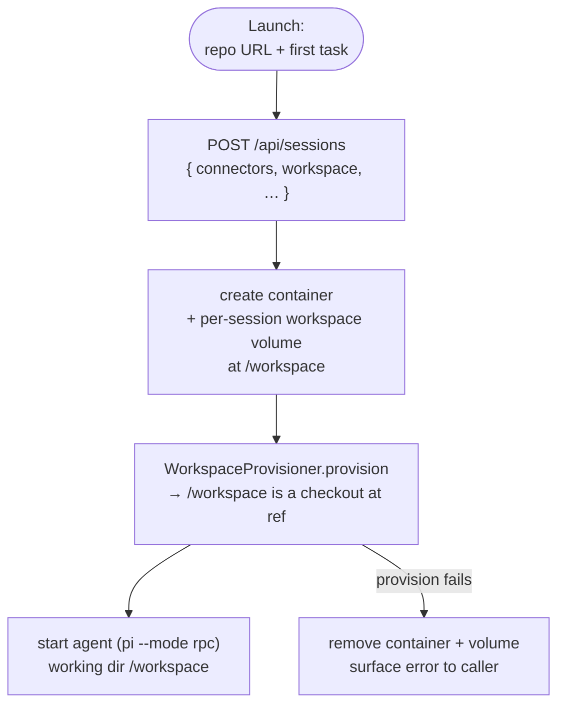
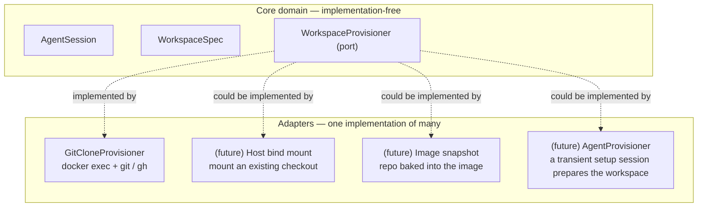

# Workspace Provisioning — Design

How an agent session gets the repository it is supposed to work on.

Today every session container starts with an empty, ephemeral `/workspace`: the agent must clone code itself, configure git identity and push auth by hand on every prompt, and everything disappears with the container. This design adds a **workspace** to the session — a persistent checkout, provisioned as one step between container creation and agent start.

## Core domain

The core domain stays about one thing: an **agent** in a session that **executes work**. Workspace provisioning is modeled as one step in that lifecycle, expressed through a small value object and a port. No tools, credentials, or transport details.

- **AgentSession** — unchanged: a long-lived agent in its own container.
- **WorkspaceSpec** — a value object `{ repoUrl, ref? }`: *what* the agent should work on.
- **WorkspaceProvisioner** — a port with one operation: `provision(session, container)`. When it resolves, `/workspace` is a checkout of the requested repo at the requested ref. *How* that happens is not the domain's business.



The pipeline is deliberately boring: create → provision → start. The domain only cares that provisioning happened before the agent starts seeing prompts.

## One contract, many implementations

`WorkspaceProvisioner` is a seam. The domain depends on the contract; concrete provisioners plug into it.



The rest of this document describes the first adapter. The core domain must never grow knowledge of `gh`, tokens, or git config.

## Adapter 1: GitCloneProvisioner

The agent image already ships `git` and `gh` (`agent-image/Dockerfile`). This provisioner uses those, plus the connector-provided environment, to produce the checkout.

```mermaid
sequenceDiagram
    participant U as UI / API
    participant S as SessionService
    participant D as DockerPort
    participant G as GitCloneProvisioner
    participant H as PiRpcHarness

    U->>S: createSession({ workspace: { repoUrl, ref? }, connectors })
    S->>S: decrypt connector secrets → container env
    S->>D: createInteractiveContainer<br/>+ volume agent-land-ws-&lt;id&gt; → /workspace
    S->>G: provision(session, container)
    G->>D: exec: git config --global user.name / user.email
    G->>D: exec: gh auth setup-git&nbsp;&nbsp;(only when GITHUB_TOKEN present)
    G->>D: exec: git clone repoUrl /workspace · git checkout ref
    G-->>S: /workspace ready
    S->>H: start(pi --mode rpc, session-dir /sessions/&lt;id&gt;)
    H-->>U: events stream (SSE)
```

Bootstrap steps, in order:

1. **Git identity** — `git config --global user.name` / `user.email`, sourced from orchestrator env (`GIT_USER_NAME`, `GIT_USER_EMAIL`). Commits are attributed correctly without relying on the agent remembering.
2. **Push auth** — `gh auth setup-git`, only when a github connector is selected (its `GITHUB_TOKEN` is already in the container env). This configures git's credential helper so `gh` supplies the token on demand; the token itself never lands in `.git/config` or any workspace file. Private clones work through the same helper.
3. **Checkout** — `git clone <repoUrl> /workspace`, then `git checkout <ref>` when a ref is given.

**Failure handling** — any failing step aborts the launch: container and workspace volume are removed and the error surfaces on the API/UI.

All credential and tooling details (steps 1–2) exist only in this adapter. A bind-mount provisioner or an image-snapshot provisioner would satisfy the same contract with entirely different mechanics.

## Considered: an agent as the provisioner

Instead of deterministic commands, another agent session could perform the provisioning — a transient "setup" session whose container mounts the same `agent-land-ws-<id>` volume and prepares the workspace before the working agent starts.

Why it's attractive:

- **One mechanism** — sessions composing sessions, no special bootstrap code path. The setup prompt would become the first real role template, and "provision" the first step of a workflow once the agent→agent channel lands.
- **Flexibility** — handles what fixed commands can't: non-GitHub hosts, submodules, "read the README and set the project up", installing dependencies.

Why it is not the default:

- **Deterministic work, non-deterministic tool** — clone + checkout + auth wiring is three commands. An LLM adds minutes of latency, token cost, and failure modes.
- **Supervision cost** — the owner watches two sessions before work starts; timeout, error, and dirty-workspace semantics all multiply.
- **Unneeded machinery** — any *judgement* work (extra setup, installs, reading the README) is already the working agent's own first task, in the same container.

Decision: ship `GitCloneProvisioner` as the default. The port stays open, so an `AgentProvisioner` adapter can be added later — cheaply, once the agent→agent channel exists — without touching the core domain.

## Persistence & lifecycle

- Per-session named volume `agent-land-ws-<id>` mounted at `/workspace`. Work survives container removal. The shared `agent-land-sessions` volume stays untouched (session data only).
- `kill()` stops the agent and removes the container but keeps the workspace volume — the checkout is not lost. Explicit pruning is a future concern.

## Config & API surface

- Orchestrator env: `GIT_USER_NAME`, `GIT_USER_EMAIL` (added to `.env.example`).
- API: `POST /api/sessions` accepts an optional `workspace: { repoUrl: string; ref?: string }`.
- UI: the launch form gains optional "Repository URL" and "Branch / ref" fields.
- Session records persist `workspace` in `data/sessions/<id>.json`.

## Explicitly out of scope

- Multiple repos per session; submodules or patch files.
- Clone strategy knobs (shallow, sparse, single-branch).
- Workspace volume pruning.
- Auth for non-GitHub hosts — later adapters can cover it without touching the domain.
